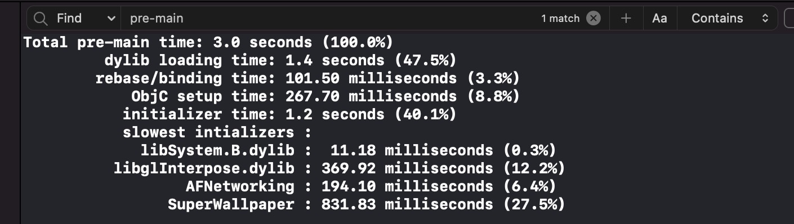
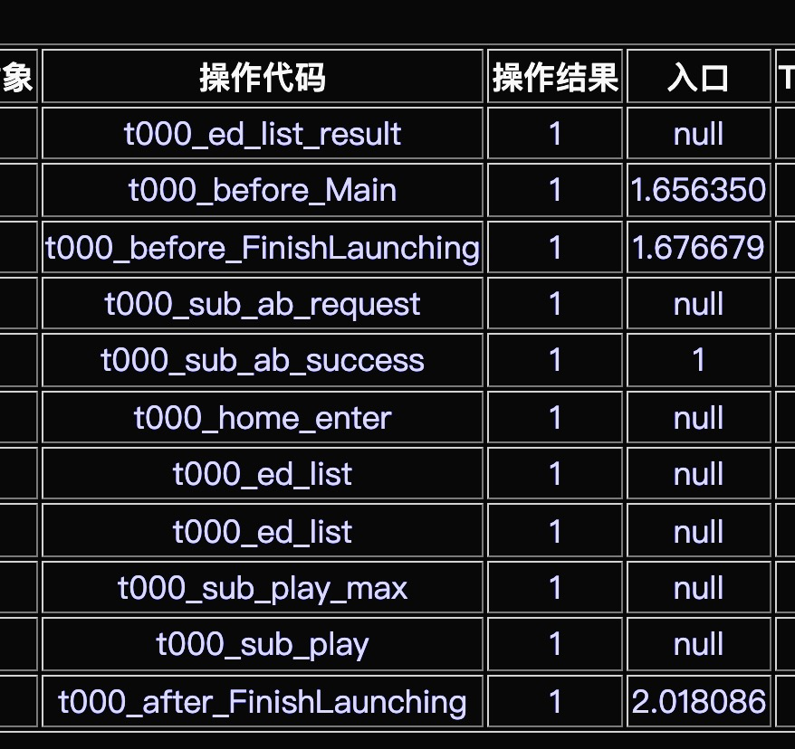
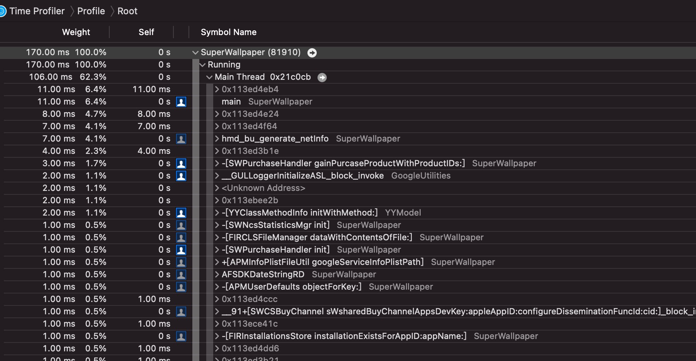

# 启动优化

## 优化的过程

1. 如何监控启动的时间
2. 启动流程是怎么样的
3. 能优化的地方是哪里？为什么？要怎么做？原理是什么

## 统计时间监控

### 1. 测量哪个启动的流程

应用启动分为三种：

- 冷启动（我们就是要这个数据）
- 热启动（app在后台且存活，再次打开）
- resume(恢复) （app已经加载过进内存，而且还没有从内存挪出来，有一段时间没有用过，被系统自动停掉）

只有在冷启动的时候会比较耗费加载的时候，因此主要是优化这个阶段的耗时。

### 2. 测量流程的阶段划分

#### 2.1 pre-main阶段

- 加载`mach-o`目标格式文件

- 加载动态库，由`dyld`加载`dylib`

  - 分析app依赖的所有`dylib`
  - 找到`dylib`对应的`mach-o`文件
  - 打开读取`mach-o`文件，并验证有效性
  - 在系统内核中注册代码签名
  - 对`dylib`的每一个`segment`调用`mmap()`

- `Rebase`和`Bind`操作

  出于安全性，所以引入了`ASLR`技术(Address Space Layout Randomization)，地址空间布局随机化。需要计算地址偏移量找回正确的开始地址。`Rebase`将镜像读入内存，根据修正后的地址读取内部数据，需要消耗`IO`性能。`Bind`查询符号表，进行外部镜像绑定。

- Objc setup

  进行`Objc`的初始化，包括注册`Ojbc`类，检测`selector`唯一性，插入分类方法等

- initializers

  往应用的堆栈中写入内容，包括`+load`方法，调用`C/C++`中构造函数(attribute((constructor))修饰的，创建非基本类型的`C++`静态全局变量等。

[摘自美团技术团队](https://tech.meituan.com/2018/12/06/waimai-ios-optimizing-startup.html)

### 加载过程—从exec()到main()

dyld在各阶段所做的事情：

| 阶段          | 工作                                                         |
| :------------ | ------------------------------------------------------------ |
| 加载动态库    | dyld从主执行文件的header获取到需要加载的所依赖动态库列表，然后需要找到每个dylib，而dylib也会依赖另外的dylib，因此需要递归加载的是动态库列表的递归依赖集合 |
| Rebase和Bind. | - Rebase在Image内部调整指针的指向。在过去，会把动态库加载到指定的地址，所有指针和数据对于代码都是对的，而现在地址空间布局是随机的，所以需要在原来的地址根据随意的偏移量做一下修正。                                                                           - Bind是把指针正确地指向Image外部的内容。这些指向外部的指针被符号(symbol)名称绑定，dydl需要去符号表里查找，找到symbol对应的实现 |
| Objc setup    | - 注册Objc类（class registration）                                                                                                                                                                                                                                                             - 把category的定义插入方法列表                                                                                                                                                                                          - 保证每一个selector的唯一 |
| Initializers  | - objcd的+load()函数                                                                                                                                                                                                                                                        - C++的构造函数                                                                                                                                                                                                                                                        - 非基本类型C++静态全局变量的创建 |

#### 2.2 mian函数阶段

从`main函数`开始执行到`didFinishLaunchingWithOptions`方法执行结束的耗时。通常这个阶段会进行各种工具的初始化，权限申请，全局配置，设定首屏

#### 2.3 首屏渲染

首页数据准备，到首页数据刷新出来能让用户操作的时机。

### 3. 测试方法选择

#### 3.1 DEBUG测试

在Xcode的`Edit scheme` -> `Run` -> `Arguments`将环境变量`DYLD_PRINT_STATISTICS`设置为`1`。则能得到如下：

#### 3.2 使用`sysctl`获取精确应用启动时间

使用`sysctl`提供的方法，获取用户点击app时刻的时间，得到最精确的开始时间，然后：

- `main函数内`获取`UIApplication`初始化之前即`pre-main`的时间
- 记录`applicationDidFinishedLaunch开始时刻的时间`即最后结束的时间，得到

## 

#### 3.3 使用Instruments的App Launch工具

## 4. pre-main阶段优化

影响这个阶段时间的因素有：

1. 动态库加载越多，启动越慢
2. ObjC类，方法越多，启动越慢（但是优化的效果不是很明显）
3. ObjC的+load越多，启动越慢
4. c的constructor函数越多，启动越慢
5. c++静态对象越多，启动越慢

##### 代码瘦身

[可以参考之前](./包体瘦身.md)

##### 二进制重排

原理：当进程访问一个虚拟内存page而对应物理内存中不存在时，会触发一个缺页中断（Page Fault）。二进制重排，主要优化我们启动时需要的函数非常分散在各个页，启动时就会触发多次却也中断，造成时间损耗。

- clang插庄获取

