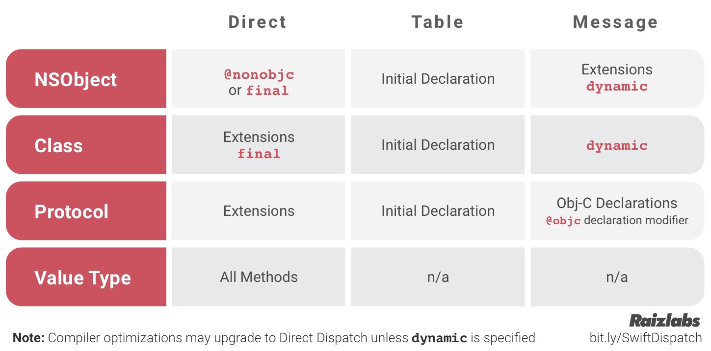

# 回答问题的技巧

```
1. 先整理，即结构为总分
```

# runtime

## 结构

#### 1.介绍下runtime的内存模型（isa、对象、类、metaclass、结构体的存储信息等）

1. isa是一个指针，出于优化内存的考虑，苹果将一个指针64位里面，在手机端上面只是用其中的33位用来存储实际的指向地址，另外的位用来存储一些例如表明当前指针是否是isa类型的指针，还有当前指向的对象是否在deallocting，还有引用计数，是否使用额外引用计数，是否使用弱引用表，关联对象，还有是c++析构器。

<update> isa指针，是一个联合体（所有属性共用一份内存，必须容纳最大的成员变量),里面定义了在arm64系统中或者桌面x86架构系统，一个isa指针中64位分别是什么内容，例如arm64中只是使用了里面的33位用来存储指针指向的实际地址，这样可以节省的内存空间。剩余的例如会表明一个对象是否有关联对象，一个对象的引用计数，是否需要使用额外的引用计数表计数，是否存在弱引用，还有是否正在deallocting，还有是否有c++的析构器。

2. 对象，在objc源码能看到id其实是objc_object指针的别名,而在oc里面id可以用于声明任意对象。objc_object里面只有isa指针，这个指针其实是指向这个对象实际的类的。而这个isa指针的类型是`class`,即`objc_class *`类型的指针，因此底层objc_object实际内容只是一个指针，指向他实际的类结构地址。

3. 类，在objc的源码中，类其实使用objc_class表示，而他又继承于objc_object，那么类的isa指针，其实指向的是他的metaclass。而类的结构里面还有一个表示缓存方法的cache_t，还有一个bits用于表示类编译期间决定的方法列表，实例变量，协议，还有描述了这个实例在内存中编译期间决定的大小，还有名字等基本信息，实例变量的布局。还有在运行时由runtime处理生成的属性列表，协议列表，方法列表。

4. metaclass的存在，是为了让设计上的统一。因为实例对象查找信息的时候回去类里面找，而类找信息的时候会去他的元类上面找。而当实例在类的缓存中找不到方法，且该类的方法列表中也找不到的时候，就会尝试去他的父级，直到NSObject的父类为nil。类查找方法的时候也是类似，从元类，父元类，到根元类，然后根元类的父类是NSObject。每一个元类的isa指针指向的是根元类。


#### 2. 为什么要设计metaclass

元类是类对象的isa指针指向的类。存储着类的类方法，为了将实例和类的相关方法列表及构造方法区分开来，各司其职。


#### 3. class_copyIvarList & class_copyPropertyList区别

1. class_copyIvarList 复制实例变量的列表，实例变量应该是在编译期间决定的，在interface的大括号{}内声明的
2.  class_copyPropertyList区别 复制属性列表，这个列表可以通过运行时增加，比较常用的是分类上声明一个属性。通过property声明的。
3. objc_method记录了一个函数的三个要素，函数名、函数参数返回值类型、函数地址。SEL等于找到函数类中唯一的识别，IMP是这个函数的实现地址。


#### 4. class_rw_t 和 class_ro_t 的区别

1. class_rw_t：是read write，表达的是一个可读可写，这个结构里面保留了class_ro_t,即类在编辑期间确定的实力变量，方法列表，协议列表等等。class_rw_t会把分类的一些信息，在运行时添加进来，能达到动态添加属性，方法列表等

<update>r和w表达read和write即rw表达是可读可写，ro只是可读。ro表达了类的这部分结构是在编译期间确定了，例如实例变量，然后在运行时是不能进行修改的。而rw，表达这部分结构能在运行时可以进行调整，例如属性，实例方法，能通过分类的方法，为一个类在运行时添加，然后和ro力原来的base内容，重新拼接出来。


#### 5. category如何被加载的,两个category的load方法的加载顺序，两个category的同名方法的加载顺序

1. 分类在编译的时候，会根据定义的名字，以及要增加分类的类生成一个全局唯一的结构体，而构造这个结构体需要的是一些类方法，实例方法，属性，协议列表等。然后通过动态链接库，及runtime在加载一个类的时候，将它为连接起来的分类列表进行一个resize及attach。将实例方法，属性协议添加到类对象上，将类方法，协议添加到元类上。
2. 分类load方法的加载顺序是按照在项目编译的顺序
3. 两个分类同名方法会先调用最后编译的


#### 6. category & extension区别，能给NSObject添加Extension吗，结果如何

1. 分类，基于运行时，可以为类添加类，实例方法，还有声明属性，但是不会增加setter和getter方法。
   一般应用于配合关联对象增加属性。或者将类的实现拆分成几块。还有的扩展三方库
2. 扩展。编译时决定的。一般用于声明私有成员变量，属性，方法等。一般需要配合.m来用，因为声明了需要实现。能为NSObject增加extension，但是只是声明而无法做其他事情。


#### 7. 消息转发机制，消息转发机制和其他语言的消息机制优劣对比

[参考这个](https://www.rightpoint.com/rplabs/switch-method-dispatch-table)

消息派发机制一共有三种，分别是：

- 直接派发，又称静态派发
- 函数表派发
- 消息机制派发

swift中，三种派发实现都有。

swift中函数派发方式与以下因素有关：
- 声明位置
- 引用类型
- 指定行为
- swift显示优化




#### 8. 在方法调用的时候，方法查询-> 动态解析-> 消息转发 之前做了什么

obj_msg_send发送消息的时候，根据消息的选择器，在类或者元类中，先查找缓存中是否命中，如果缓存没有命中，则在类或者元类中的方法列表中查询，如果没有则从父类的方法列表中查找，直到NSObject，如果没有，则进入动态解析，消息转发，还有完成的消息转发流程。


#### 9. IMP、SEL、Method的区别和使用场景

IMP：指向方法实现的地址
SEL：方法选择子，用字符串代表唯一的代表一个方法的内容
Method.

<update> 类结构中的method_list中，存储的结构是objc_method，里面包含了一个函数的三个要素，即函数名字，函数实现，函数的类型。分别是SEL代表方法名，SEL是一个objc_selector指针，就是简单保存一个方法的名字的字符串。函数类型，保存了函数的返回值参数等，叫做type encode。然后IMP，实际上是指向函数实现地址的指针。


#### 10. load、initialize方法的区别什么？在继承关系中他们有什么区别

1. load，是应用载入内存的时候，这个文件首次加载的时候会调用，只会调用一次。加载的顺序是根类，父类，子类，分类。不受继承影响，不重写也不会调用父类的方法。会在分类方法替换之后才会进入load。
2. initial，是该类首次调用的时候调用，类似懒加载，也是只会调用一次。调用顺序是根类，父类，子类，会被分类覆盖，并且会调用父类的方法。


#### 11. 说说消息转发机制的优劣


## 内存管理

1. weak的实现原理？SideTable的结构是什么样的
2. 关联对象的应用？系统如何实现关联对象的
3. 关联对象的如何进行内存管理的？关联对象如何实现weak属性
4. Autoreleasepool的原理？所使用的的数据结构是什么
5. ARC的实现原理？ARC下对retain & release做了哪些优化
6. ARC下哪些情况会造成内存泄漏

## 其他

1. Method Swizzle注意事项
2. 属性修饰符atomic的内部实现是怎么样的?能保证线程安全吗
3. iOS 中内省的几个方法有哪些？内部实现原理是什么
4. class、objc_getClass、object_getclass 方法有什么区别?

# NSNotification

1. 实现原理（结构设计、通知如何存储的、name&observer&SEL之间的关系等）
2. 通知的发送时同步的，还是异步的
3. NSNotificationCenter接受消息和发送消息是在一个线程里吗？如何异步发送消息
4. NSNotificationQueue是异步还是同步发送？在哪个线程响应
5. NSNotificationQueue和runloop的关系
6. 如何保证通知接收的线程在主线程
7. 页面销毁时不移除通知会崩溃吗
8. 多次添加同一个通知会是什么结果？多次移除通知呢
9. 下面的方式能接收到通知吗？为什么

# Runloop

1. app如何接收到触摸事件的
2. 为什么只有主线程的runloop是开启的
3. 为什么只在主线程刷新UI
4. PerformSelector和runloop的关系
5. 如何使线程保活

# KVO

1. 实现原理
2. 如何手动关闭kvo
3. 通过KVC修改属性会触发KVO么
4. 哪些情况下使用kvo会崩溃，怎么防护崩溃
5. kvo的优缺点

# Block

1. block的内部实现，结构体是什么样的
2. block是类吗，有哪些类型
3. 一个int变量被 __block 修饰与否的区别？block的变量截获
4. block在修改NSMutableArray，需不需要添加__block
5. 怎么进行内存管理的
6. block可以用strong修饰吗
7. 解决循环引用时为什么要用__strong、__weak修饰
8. block发生copy时机
9. Block访问对象类型的auto变量时，在ARC和MRC下有什么区别


# 多线程

1. iOS开发中有多少类型的线程？分别对比
2. GCD有哪些队列，默认提供哪些队列
3. GCD有哪些方法api
4. GCD主线程 & 主队列的关系
5. 如何实现同步，有多少方式就说多少
6. dispatch_once实现原理
7. 什么情况下会死锁
8. 有哪些类型的线程锁，分别介绍下作用和使用场景
9. NSOperationQueue中的maxConcurrentOperationCount默认值
10. NSTimer、CADisplayLink、dispatch_source_t 的优劣

# 视图&图像相关

AutoLayout的原理，性能如何
UIView & CALayer的区别
事件响应链
drawrect & layoutsubviews调用时机
UI的刷新原理
隐式动画 & 显示动画区别
什么是离屏渲染
imageName &  imageWithContentsOfFile区别
多个相同的图片，会重复加载吗
图片是什么时候解码的，如何优化
图片渲染怎么优化
如果GPU的刷新率超过了iOS屏幕60Hz刷新率是什么现象，怎么解决

# 性能优化

如何做启动优化，如何监控
如何做卡顿优化，如何监控
如何做耗电优化，如何监控
如何做网络优化，如何监控


# 开发证书

苹果使用证书的目的是什么
AppStore安装app时的认证流程
开发者怎么在debug模式下把app安装到设备呢

# 架构设计

只是列出一些iOS比较核心的开源库，这些库包含了很多高质量的思想，源码学习的时候一定要关注每个框架解决的核心问题是什么，还有它们的优缺点，这样才能算真正理解和吸收

AFN
SDWebImage
JSPatch、Aspects(虽然一个不可用、另一个不维护，但是这两个库都很精炼巧妙，很适合学习)
Weex/RN, 笔者认为这种前端和客户端紧密联系的库是必须要知道其原理的
CTMediator、其他router库，这些都是常见的路由库，开发中基本上都会用到
请圈友们在评论下面补充吧


# 其他问题

PerformSelector & NSInvocation优劣对比
oc怎么实现多继承？怎么面向切面（可以参考Aspects深度解析-iOS面向切面编程）
哪些bug会导致崩溃，如何防护崩溃
怎么监控崩溃
app的启动过程（考察LLVM编译过程、静态链接、动态链接、runtime初始化）
沙盒目录的每个文件夹划分的作用
简述下match-o文件结构


# 系统基础知识

进程和线程的区别
HTTPS的握手过程
什么是中间人攻击？怎么预防
TCP的握手过程？为什么进行三次握手，四次挥手
堆和栈区的区别？谁的占用内存空间大
加密算法：对称加密算法和非对称加密算法区别
常见的对称加密和非对称加密算法有哪些
MD5、Sha1、Sha256区别
charles抓包过程？不使用charles，4G网络如何抓包

# 数据结构与算法

八大排序算法
栈&队列
字符串处理
链表
二叉树相关操作
深搜广搜
基本的动态规划题、贪心算法、二分查找