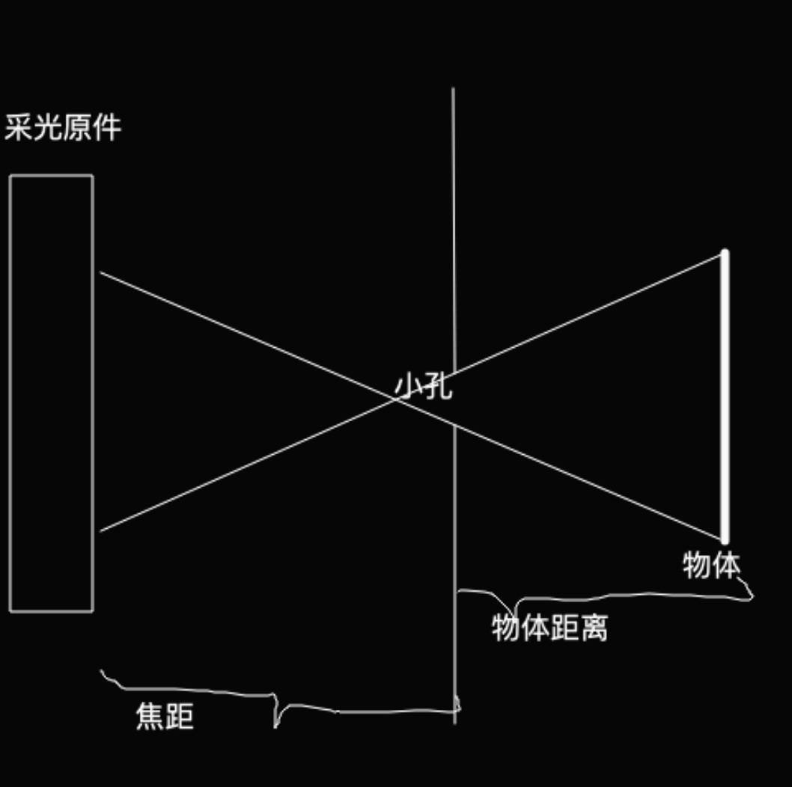

### 1. MVP

- 模型矩阵
- 相机矩阵
- 投影矩阵
  - 投影矩阵计算里面有个fov（视觉）的函数，表示投影可是区域

### 2. 小孔成像的原理

所以能根据`屏幕上点到中心的距离`和`焦距`的`比值`**等于**物体`某个点到中心的距离`和`物体实际距离`的比值的关系。然后根据深度图中，每个像素值能取出一个深度信息值，即物体实际距离，可以还原出物体实际的一个大小。

#### 3. mesh网格

一般使用三角形三个顶点来作为图元进行装配，因此如果需要大量数据的时候，就可能需要很大量的顶点坐标。但是如果当顶点间会有重复的点进行使用的时候，可以使用mesh网格，只需要将坐标，即三个顶点使用坐标的序号，来优化顶点数据的空间。

#### 4. 怎么实现摇摆效果

MVP中，只需要根据时间，对V的矩阵，按时间变化，做从左到右，再才从右到左的角度旋转，应用到原来相机的矩阵中。除此之外，其实可以做伸缩，平移。同时在这个前景和后景，使用一系列的图片，营造出人像是真的在摇摆的效果。