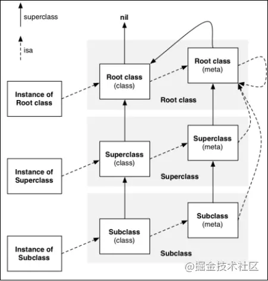
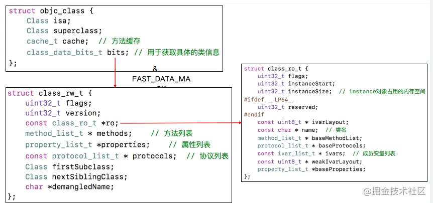
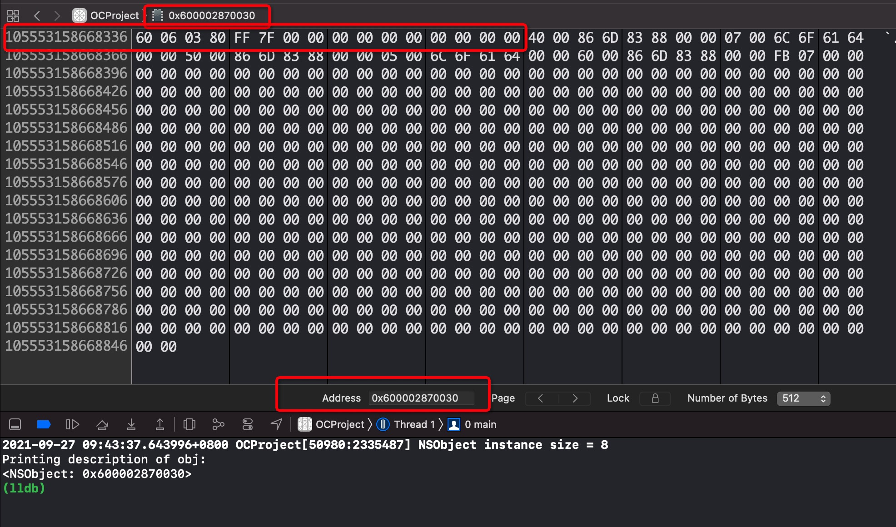
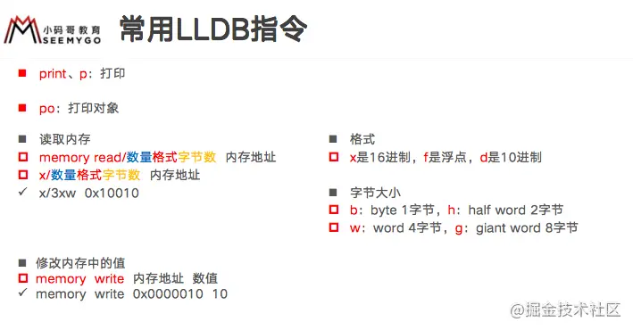

##### 面试题

- 一个NSObject对象占用多少内存	
- 对象的isa指针指向哪里
- OC的类信息放在哪里


### 1. Objective-C的本质

OC代码底层实现是C/C++的代码，OC对象的底层是一个结构体，对象结构体里面都有`isa`指针及其他信息。

将Objective-C转成c/c++源码可以使用：

```
xcrun -sdk iphones clang -arch arm64 -rewrite-objc xxx.m -o xxx.cpp
```


### 2. OC对象分类

可以分为三类：

- 实例对象(instance)
- 类对象(class)
- 元类对象(meta-class)

#### 2.1 实例对象

- 由[[xx alloc] init]生成的对象，底层实现是一个结构体。

- 结构体里面包含一个`isa`指针，指向他类对象的地址。然后和它的其他成员变量信息。包括用大括号声明的成员变量，还有声明属性然后便捷生成出来的成员变量。

- alloc后内存空间就固定了，内存大小和成员变量是相关的。跟结构体内存对齐有关。

#### 2.2 类对象

- isa指针，指向元类
- superclass指针，指向父类
- 属性信息(@property),实例变量信息(ivar)
- 对象方法信息(instance method)，协议信息(protocol)

成员变量的值会存储在实例变量中，当我们创建实例对象的时候，会依照类中存储的成员变量内存布局，进行内存空间的分配，并且在初始化或后面运用的时候，进行成员变量的值的变化。至于成员变量叫什么是什么类型，以及类有什么方法遵守什么协议，只需要有一份原本，存储在类对象中即可。

#### 2.3 元类对象

每个类在内存中仅有一个元类对象，他和类对象的内存结构一样，但是因为类只有类方法，因此其他的属性信息，实例方法，成员变量信息对象方法信息均为空

- isa指针，指向根元类
- superclass指针，指向父类的元类
- 类的类方法信息
- 属性信息，实例方法信息，协议信息，成员变量信息但是内容为空


### 3. isa指针的指向

isa可以大概认为是指向类对象的地址或者是元类对象的地址，实际地址值需要`&`上一个mask值才能得到真正的地址值。因为64位系统下不是整个isa指针8字节都用来存储地址。

- 实例对象的isa指针指向它的类对象，类对象的isa指针指向他的元类对象。元类对象的isa指针指向根元类对象。根元类对象的isa指针指向自身
- 类对象的superclass指针指向他的父类，NSObject的superclass指针指向nil。元类的superclass指针指向他父类的元类对象。根元类的superclass指针指向NSObject类对象。



#### 3.1 实例方法，类方法消息传递路径

- 实例对象通过isa指针，找到类对象，查找类对象的方法缓存，没有则查找类对象的实例方法列表，没有则一直向superclass的类对象中的查找。
- 类对象的通过isa指针，找到元类对象，然后在元类的缓存->方法列表中查找，然后一直往superclass的父类元类对象中查找
- 不管类对象还是元类对象，类型都是`class`，`class`和`meta-class`的底层都是`objc_class`结构体指针，内存中就是结构体。

```objc
Class objctClass = [NSObject class];// 获取类对象，无论调用多少次，都是返回类对象
Class objctMetaClass = object_getClass([NSObject class]);//获取元类对象，调用多次会一直获取isa指针指向的内容
```


### 4. Class的本质

不管是类对象还是元类对象，类型都是Class，底层都是objc_class结构体。




- 类对象中包含了
  - isa指针
  - superclass指针
  - 方法缓存列表
  - bits具体类数据信息，使用与操作可以得到`class_rw_t`可读可写表
- `class_rw_t`类型的可读可写表包含了
  - 方法列表
  - 属性列表
  - 协议列表
  - `class_ro_t`只读表
-  `class_ro_t`只读表包含了
  - ivars，成员变量信息
  - 编译期间确定好的方法列表
  - 编译期间确定好的协议列表
  - 编译期间确定好的属性列表
- cache_t:已经调用过的方法就会缓存在cache_t。通过key和mask进行计算出存储在数组中的index。散列表底层数组长度不够会进行扩容。
  - 散列表bucket_t
    - Key--SEL
    - Value--IMP

### 面试题答案

#### 1. 

系统分配16个字节给NSObject对象，但`NSObject`对象内部只使用了8个字节的空间(64bits下)，可以使用`class_getInstanceSize`获取

#### 获取对象的空间

```objc
// 获取对象实际占用空间，结构体对齐
class_getInstanceSize([NSObject class]);
/* 获取对象内存分配大小。 oc代码有优化，使用16，32，64，128，256字节这几种大小进行分配。
alloc -> allocWithZone ，底层源码中，指定最低分配16字节。
*/
malloc_size((__bridge const void*)obj);

```

##### 验证给NSObject对象分配了16个字节，但实际使用的是8个字节

使用xocde->Debug->Debug workflow->view memory,然后在窗口地址中输入类地址信息，即可以在窗口查看类在内存中存储的内容。



从图中可以看到，(iOS是小端)所以每8个字节从右往左读。可以看到后面的8组数都是0.一对16进制数等于8位，等于一个字节。因此图中4个分组为4个字节。


#### 2. 

#### 对象的isa指针指向的是他的类对象的地址。类对象的isa指针指向的是他的元类对象地址，而元类对象的isa指向都是根元类对象的地址。

#### 3.

OC的类的信息会放在他的元类对象中。

- OC的类信息放在哪里


#### 附




