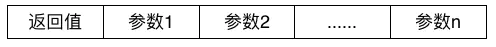
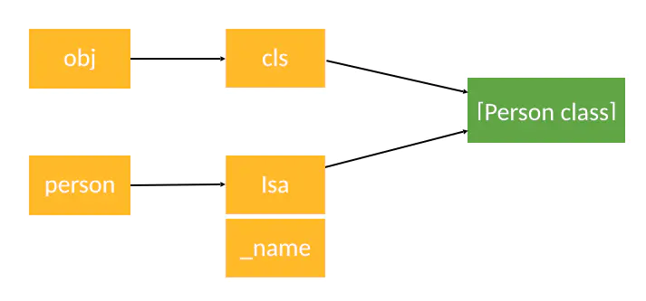
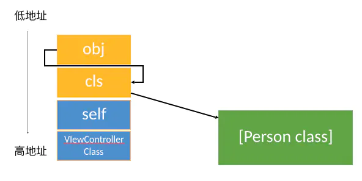

### rumtine日常应用

- 利用关联对象给类添加属性
- 遍历类的所有成员变量，修改textfield的占位文字颜色、字典转模型、自动归档解档
- 交换方法的实现
- 利用消息转发机制，解决方法找不到的异常。


### 1. isa详解

在arm64架构之前，isa是一个普通指针，里面就是存储的class，meta-class对象的内存地址

在arm64之后，对isa进行了优化，使用共用体(`union`)+位域，将一个8字节的空间不仅用来存储对象的地址，还用剩余的空间存储一些和对象有关系的参数。

```objc
// 8个字节，64位
typedef unsigned long           uintptr_t; 
union isa_t 
{
    Class cls;
    uintptr_t bits;
# if __arm64__
#   define ISA_MASK        0x0000000ffffffff8ULL
#   define ISA_MAGIC_MASK  0x000003f000000001ULL
#   define ISA_MAGIC_VALUE 0x000001a000000001ULL
    struct {
        uintptr_t nonpointer        : 1;
        uintptr_t has_assoc         : 1;
        uintptr_t has_cxx_dtor      : 1;
        uintptr_t shiftcls          : 33; // MACH_VM_MAX_ADDRESS 0x1000000000
        uintptr_t magic             : 6;
        uintptr_t weakly_referenced : 1;
        uintptr_t deallocating      : 1;
        uintptr_t has_sidetable_rc  : 1;
        uintptr_t extra_rc          : 19;
#       define RC_ONE   (1ULL<<45)
#       define RC_HALF  (1ULL<<18)
    };
};
```

共用体：类似结构体，不过里面的成员公用一个最大成员的空间。

位域：用来描述每个成员各占用多少空间


帮助记忆的话：当我们使用一些位数用来存储一些数据的时候，我们可能使用位运算，但是我们其实可以将这些数合起来作为一个数进行存储，这个时候就是用union联合体，只用一个联合体例如8字节上的位，分别使用不同的位数来存储不一样的数据，并且使用位域来描述说明每一位分别存储什么数据。


#### 1.1 每个位的详解


##### nonpoiter：是否代表普通的指针

##### has_assoc: 是否设置过关联对象，如果没有则释放更快

##### has_cxx_dtor: 是否有C++的析构器，如果没有则释放更快

##### shiftcls：表示指针指向的地址

##### magic：

##### weakly_referenced：是否有被弱引用过，，如果没有则释放更快

##### deallocating：对象是否正在释放

##### extra_rc:存储着引用计数器减1

##### has_sidetable_rc：引用计数器过大无法存储在isa中，使用SideTable的类属性中。


### 2 Class的结构

```objc
// objc_object
struct objc_object {
private: 
		isa_t isa;
}

struch objc_class: objc_object {
  // isa_t isa;等于把objc_object拿过来当第一位
  Class superClass;
  cache_t cache; //方法缓存
  class_data_bits_t bits; //用于获取具体类信息
}

struct class_rw_t {
  //成员变量只是只读的，在类objc_registerClassPair之后就不能添加了
	class_ro_t *ro;
  // 方法，属性，协议这些在class_rw_t类中的这几个是类创建后不影响内存布局的就可以动态添加
  method_array_t methods; //方法列表
  property_array_t properties; //属性列表
  protocol_array_t protocols; //协议列表
  // 方法、属性、协议是二维数组，是可读可写的。包含了类的初始内容、分类内容。
}

struct class_ro_t {
   //......省略
  char *name;
  method_list_t * baseMethods;
  protocol_list_t * baseProtocols;
  ivar_list_t *ivars; //成员变量列表
  uint8_t * weakIvarLayout;
  property_list_t *baseProperties; 
    // 基础属性、方法、属性和成员变量，就是在类本身中定义好的，在运行时不能再进行变更的一份只读表.
  // 这里的方法、属性、成员变量是一维数组，是只读的。
}
```


### 3 函数的封装

```objc
struct method_t {
	SEL name;// 函数名
	char *types;// 编码（返回值类型，参数类型）
	IMP imp; // 指向函数的指针（函数地址）
}

// IMP代表函数的实现
typedef id _Nullabel (*IMP)(id _Nonull, SEL _Nonnull, ...);

typedef struct objc_selector *SEL;
```


####  3.1 SEL

SEL代表方法、函数名，一般叫做选择器，底层结构跟char *类型。

可以通过`@selector()`和`sel_registerName()`获得

可以通过`sel_getName`和`NSStringFromSelector()`转成字符串

不同类中相同名字的方法，所有的方法选择器是相同的。


#### 3.2 Types

types包含了函数返回值、参数编码的字符串



iOS中提供了`@encode`的指令，可以将具体的类型表示成字符串编码


#### 3.3 方法缓存

class内部结构中有个方法缓存(cache_t)，用散列表来缓存曾经调用过的方法，可以提高方法的查找速度。

```objc
struct cache_t {
	struct bucket_t *buckets; //散列表
	mask_t mask; //散列表长度-1
	mask_t occupied;//已经缓存的方法数量
}

struct bucket_t {
	uintptr_t imp;//函数内存地址
	SEL sel; // sel作为key
}
```

##### 3.3.1 缓存插入

cache_t结构的mask是根据散列表长度减一，之后每次插入方法缓存的时候，会将插入的bucket_t的SEL内存地址与mask进行掩码，算出实际在散列表中的序号。当散列表中的序号被占用的时候，就会将序号往前面找，直到等于0号又会从末尾开始回头找。

##### 3.3.2 缓存查找

根据方法选择器的地址与mask进行掩码，得到散列表中的序号，查看该序号下的bucket_t的方法选择器是否等于查找的。如果不是就向前面查找，直到找到0号就从末尾开始回头找。如果散列表中找不到，就回到类的方法列表中查找。


### 4 objc_msgSend执行流程

OC方法中的方法调用，其实都是转成objc_msgSend函数的调用

```objc
// 实例作为消息接收者
NSObject* obj = [[NSObject alloc] init];
objc_msgSend(objc,@selector(init));
// 类对象作为消息接收者
[NSObject initialize];
objc_msgSend([NSObject class],@selector(initialize));
```


#### 4.1 消息发送分布


#####  4.1.0 底层，消息发送到报错无法识别方法选择器

```objc
// message.h
objc_msgSend(id self, SEL op, ...)
// objc-msg-arm64.s  汇编代码
ENTRY _objc_msgSend
.....
 __class_lookupMethodAndLoadCache3
.....
END_ENTRY _objc_msgSend
// objc-rumtime-new.mm
IMP _class_lookupMethodAndLoadCache3(id obj, SEL sel, Class cls) {
  return lookUpImpOrForward(cls, sel, obj, 
                              YES/*initialize*/, NO/*cache*/, YES/*resolver*/);
}
// 最终的查找细节在这个方法里面
lookUpImpOrForward
```

```objc
// 外国小哥尝试写出的`__forwarding`底层实现
int __forwarding__(void *frameStackPointer, int isStret) {
    id receiver = *(id *)frameStackPointer;
    SEL sel = *(SEL *)(frameStackPointer + 8);
    const char *selName = sel_getName(sel);
    Class receiverClass = object_getClass(receiver);

    // 调用 forwardingTargetForSelector:
    if (class_respondsToSelector(receiverClass, @selector(forwardingTargetForSelector:))) {
        id forwardingTarget = [receiver forwardingTargetForSelector:sel];
        if (forwardingTarget && forwardingTarget != receiver) {
            return objc_msgSend(forwardingTarget, sel, ...);
        }
    }

    // 调用 methodSignatureForSelector 获取方法签名后再调用 forwardInvocation
    if (class_respondsToSelector(receiverClass, @selector(methodSignatureForSelector:))) {
        NSMethodSignature *methodSignature = [receiver methodSignatureForSelector:sel];
        if (methodSignature && class_respondsToSelector(receiverClass, @selector(forwardInvocation:))) {
            NSInvocation *invocation = [NSInvocation _invocationWithMethodSignature:methodSignature frame:frameStackPointer];

            [receiver forwardInvocation:invocation];

            void *returnValue = NULL;
            [invocation getReturnValue:&value];
            return returnValue;
        }
    }

    if (class_respondsToSelector(receiverClass,@selector(doesNotRecognizeSelector:))) {
        [receiver doesNotRecognizeSelector:sel];
    }

    // The point of no return.
    kill(getpid(), 9);
}
```


1. 进行消息接收者检查，如果为空则直接返回
2. 进行消息发送，即下面消息发送
3. 进行`class_resolveMethod`尝试，如果尝试过，则从头开始查找，因为可能进行动态方法解析(进行了动态添加方法)
4. 调用不公开的`__forwarding__`函数，从找不到方法选择器崩溃的堆栈中可以看到，进入消息转发流程
   1. 查看`forwardingTargetForSelector`是否存在，然后使用`objc_msgSend`进行发送，将消息进行转发给能处理的对象。
   2. 查看`methodSignatureForSelector`方法签名是否有返回，然后使用包装好的`NSInvocation`进行调用`forwardInvocation`进行完整消息转发。


##### 4.1.1 消息发送


用自己的话总结就是：

1. 从消息接收者isa指向的类开始查找
   1. 先从他的方法缓存列表开始查找，如果查找到则直接返回给接收者调用
   2. 如果缓存列表没找到，则从`class_data_bits_t`与上取值掩码后，得到`class_rw_t`读写表，从里面的方法列表查找。
   3. 如果是排序好的方法列表则使用二分查找。如果是未排序的列表，则进行遍历查找。
   4. 如果查找到，则将方法写入到缓存列表，然后返回给接收者调用
2. 如果接收者的isa指向的类没有找到的话，则根据isa指向的类中的superClass指针，往父级进行查找，然后重复上面（1）中的两步
3. 直到所有的superClass都遍历完，仍找没有找到对应的方法进行调用，则进入动态方法解析。


##### 4.1.2 动态方法解析

```objc
void c_other(id self,SEL _cmd){ NSLog(@"c 方法") };
- (void)other{ NSLog(@"OC 方法") }；
// 实例动态方法解析
+ (BOOL)resolveInstanceMethod:(SEL)sel {
  // 使用c语言的函数地址进行添加
  class_addMethod(object_getClass(self),sel,(IMP)c_other,"v@:");
  // 使用OC方法进行动态添加
	Method  method = class_getInstanceMethod(self,@selector(other));
  class_addMethod(object_getClass(self),sel,
                  method_getImplementation(method),
                 method_getTypeEncoding(method));
  return YES;
}

+ (BOOL)resolveClassMethod:(SEL) sel {
  // 和上功能同理
  // 由于这里是类方法获取objct_getClass，因此这里会使用元类的对象进行添加方法。
}
```


##### 4.1.3 消息转发

```objc
/* 
方法可以为实例、类方法，运行时分别类，为元类转发消息
*/
- (id)forwardingTargetForSelector:(SEL)aSelector {
    if (aSelector == @selector(test)) {
        return  [ForwardingTarget new];
    }
    return [super forwardingTargetForSelector:aSelector];
}


- (NSMethodSignature *)methodSignatureForSelector:(SEL)aSelector {
    if (aSelector == @selector(test)) {
        return [NSMethodSignature signatureWithObjCTypes:"v@:"];
    }
    return [super methodSignatureForSelector:aSelector];
}

- (void)forwardInvocation:(NSInvocation *)anInvocation {
    SEL sel = anInvocation.selector;
    if (sel == @selector(test)) {
        [anInvocation invokeWithTarget:[ForwardingTarget new]];
        return;
    }
    [super forwardInvocation:anInvocation];
}

```

- `forwardInvocation`方法中自定义任何逻辑，因为`NSInvocation`中封装着sel,target,`MethodSignature`中封装着各个参数
- 以上方法都可以实例方法、类方法的版本，需要自己选择`-`或者`+`


### 5. super机制

```objc
    
{
	NSLog(@"[self class] = %@", [self class]); // SuperKeyword
  NSLog(@"[self superclass] = %@", [self superclass]); // SuperKeywordFather
  NSLog(@"--------------------------------");
  NSLog(@"[super class] = %@", [super class]); // SuperKeyword
  NSLog(@"[super superclass] = %@", [super superclass]); // SuperKeywordFather
}

// 底层
- (Class)class {
  // 返回self实例isa指向的类对象
  return object_getClas(self); 
}
- (Class)superClass {
  // 返回self实例isa指针指向的类对象的superClass类对象
  return class_getSuperclass(object_getClass(self));
}

/*
底层super的实现:实际是转成使用`objc_super`结构体去调用方法objc_msgSendSuper
*/
static void _I_SuperKeyword_log(SuperKeyword * self, SEL _cmd) {
  struct objc_super arg = {(id)self, [Person class]};
  objc_msgSendSuper(arg,@selector(run));
}

struct objc_super {
  id receiver; //消息接收者
  Class super_class; //消息接收者的父类。
}
```

```assembly
    ENTRY _objc_msgSendSuper2
    UNWIND _objc_msgSendSuper2, NoFrame

    ldp p0, p16, [x0]       // p0 = real receiver, p16 = class
    ldr p16, [x16, #SUPERCLASS] // p16 = class->superclass
    CacheLookup NORMAL, _objc_msgSendSuper2

    END_ENTRY _objc_msgSendSuper2
```


- 从代码进行过程中，进行断点，查看汇编代码。可以看到调用`[super xxx]`，实际会进行`objc_msgSendSuper2`的方法调用。
- 虽然`objc_super`结构体传入了消息接收者，和消息接收者的父类，但是汇编代码中，方法寻找是从`class->superclass`开始查找


### 6. 内存布局

```objc
//
id cls = [Person class];
void *obj = &cls;
[(__bridge id)obj print];	
// 创建实例的过程
Person *p = [[Person alloc] init];
```


| 栈内存地址由高到低分配，且相当于整个结构倒着在内存中。 | 内容                        |
| ------------------------------------------------------ | --------------------------- |
| 0x-------FF                                            | [super viewDidLoad]函数地址 |
| 0x-------F8                                            | cls指针                     |
| 0x-------F0                                            | obj指针                     |


| Person实例内存分部 | 内容                                                         |
| ------------------ | ------------------------------------------------------------ |
| 0x-------F8        | 成员变量_name                                                |
| 0x-------F0        | isa指针，指向Person类对象的地址。同时这个地址由于是结构体的第一位，也是实例对象的地址值 |


例子中：

- cls指针指向的是Person类的地址
- obj指针指向的是cls的地址

实际创建实例的过程

- p指针指向实例的内存地址
- 而内存地址布局是`isa`,成员变量

__因此，结合上面两个比较，可以得出__



- obj指针实际等于person实例对象的指针，因此可以进行`[(__bridge id)objc print]`进行方法调用
- 同时由于obj是指向person实例，因此在进行person成员变量查找的时候，使用的是内存偏移值进行查找。
  - _name成员变量是一个字符串指针类型，占8字节，即从person实例对象的isa指针往上8字节进行查找。
- 但是这时候栈中上文的8字节，其实是[super viewDidLoad];函数调用的内容
  - 由低到高，分别是`objc_msgSendSuper2`函数中参数从左到右的数据
    - `objc_super2`结构体,消息接收者，和消息接收者的父类
    - 方法选择器




### 7. isKindOfClass和isMemberOfClass区别

底层源码

```objc
// 实例方法
// 判断你输入类的isa指针是否指向目标类
- (BOOL)isMemberOfClass:(Class)cls {
	return [self class] == cls;
}
// 判断输入的类，或者他父类的isa指针指向，是否等于目标类
- (BOOL)isKindOfClass:(Class)cls {
	for (Class tcls = [self class]; tcls ; tcls = tcls -> superClass) {
		if (tcls == cls) return YES;
	}
	return NO;
}

// 类方法
// 判断传入类的元类 是否等于目标类
+ (BOOL)isMemberOfClass:(Class)cls {
  return object_getClass((id)self) == cls;
}
// 判断传入类及其父类的元类 是否等于目标类
+ (BOOL)isKindOfClass:(Class)cls {
  for (Class tcls = object_getClass((id)self); tcls ; tcls = tcls -> superClass) {
    	if (tcls == cls) return YES;
  }
  return NO;
}
```

同时需要记住`Class`方法，`object_getClass`方法

```objc
// 源码
// 类的class方法返回自身
+ (Class)class {
	return self;
}
// 实例的class方法返回isa指针指向的类对象
- (Class)class {
  return object_getClass(self);
}

// object_getClass返回对象的isa指针
Class object_getClass(id obj) {
  if (obj) return obj->getIsa();
  else return Nil;
}
```


### 8 Runtime的API


### 9 关联对象