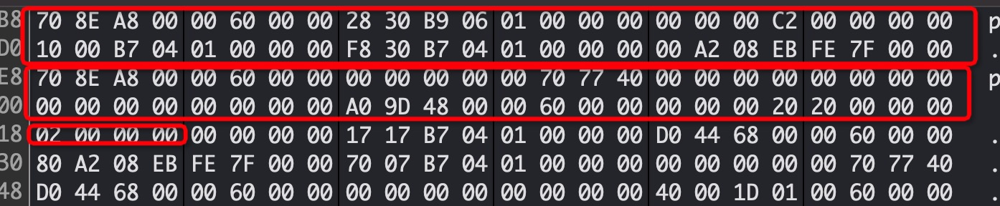

## 1. 准备

使用两个int型变量，查看两个变量的地址，以及在内存中的分布，来确定iOS中，栈中的变量是怎么“生长”的。

### 1.1 根据代码中`start`变量先于`test `变量，但是内存地址中发现，`start`变量的内存值会小于`test`变量的内存值。查资料也能验证，程序内存块中，栈的地址值分配是`由大到小的`。

此外，可以使用view memory功能，根据内存地址值，查看内存中存储的内容。根据`0x7ffeee1ebccc8`地址值，看可以看到`test`变量内存中存储的值是2。 这里高位存储着低位的数据，是因为iOS内存是小端的原因。[大端和小端。](https://www.cnblogs.com/luxiaoxun/archive/2012/09/05/2671697.html)。并且由于int类型占4个字节，因为在堆中往上即往大地址查找4个字节的时候，就能看到`before`变量。

### 结论：

根据打印的地址值x，和上一个变量的地址值y，可以根据y-x得到x变量内存中分配的大小，实际占用的问题，还需要考虑`内存对齐`。

## 2. 查看block内存占用

根据第一步的原理，也是用一个int，一个block，内存地址查看。

### 3. 用block底层代码进行指针内容转换

可以看到，篮框中表示的是`impl`指针内存地址中的内容，跟第二个红框中的开头的`8个字节`内容是一样的。**是block存储在堆中的地址，可以根据这个地址进去查看一下，得到的结构就是block底层的结构体内容。**。查看`_block_desc`中描述block_size的值为40，但是应该是没有算上截获变量的值。截获变量之后应该是44个字节，然后算上内存对齐，应该是会有48个字节。打印上下两个变量的地址值差值可以得到。

### 4. 截获加了__block后的block内存存储了啥

加了截获`__block`变量后，无论是block指针的值，还是底层block结构体的内存地址，都是变成了48个字节。最明显的是看到了，底层block结构的最后8个字节，由原来的只是截获变量`02 00 00 00`+内存对齐，变成了`_block_byref_val`结构体的地址值。

截获`__block`变量的指针内存变成了24字节。没有截获的话就只有8个字节。这个我也不知道截获`__block`变量之后，多出来的16个字节内容是啥。然后后面跟着的28个字节+4个字节对齐，就是`__block`截获变量生成的`block_byref_val`结构体

### 5. 多试尝试创建几个查看内存的内容

所以能看到后面创建的myblock2,myblock3在内存中的结构，跟底层的结构是一致的。除了第一个block。就只有isa指针的值。

### 6. 终于明白所有内容的值是什么了。

第一次使用block的时候，头8位存储的内容是指向堆中实际底层结构的内存地址。跳转过去是能看到完整的40字节的内容。

后面16字节，确实不知道是啥。再到后面跟着的28字节就是`__block`截获的变量。

能发现如果使用三次block截获同一个变量值的时候，第一次的时候，会使用完整的`__block_byref_val`28字节空间来存储。并且`__forwarding`指针是堆中变量值的地址。而这时候使用block截获完的变量值的实际地址，会变为堆中实际存储这个变量值的地址。而后面再截获这个变量值的时候，block中只需要使用8个字节的指针指向第一次使用这个变量的栈地址。

偶然发现红框内的地址值，跟target被截获到堆中的地址值很相近。然后查看一下！

然后就发现了一个跟`__block_byref_val`结构相近的内容，绿框的内容就是`__forwarding`指针指回自身的指针值。24位开始就是被截获变量实际的值。

### 结论：

1. block的内存地址，其实是存储着他指向的block结构体的地址。而又会根据它是否有截获`__block`变量，由8个字节变成24个字节。但是开头的8个字节永远是指向底层block结构体的内存地址。
2. block底层的数据结构，跟clang编译后的`__block_impl_0`一致，`__block_impl`结构体是24个字节，里面有`isa`,两个`int`，一个函数指针，剩余两个地址指针。因此一共是40个字节。

### 7 验证一下

#### 7.1 堆中的变量，block释放之后，是否内存地址值变回栈中

首先，大括号内myblock释放后，能得到val的堆中地址内容还没有归零。但是如果进行一个延时操作之后再到堆中查看，就会发现内容已经被重新覆盖。因此可以认为`block_object_disopose，约等于release，但是arc下需要等autoreleasepool下个循环才能帮忙回收。`

然后我们能发现使用了`__block`修饰的变量，会在栈上变成了28个字节的`block_byref_val`对象。

## 工具：

1. 查看根据内存地址，查看内存中存储的内容

   debug->debug workflow->view memory