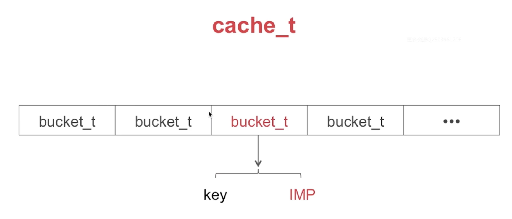
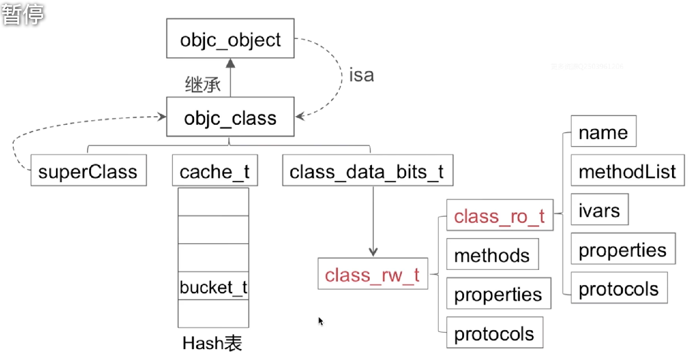
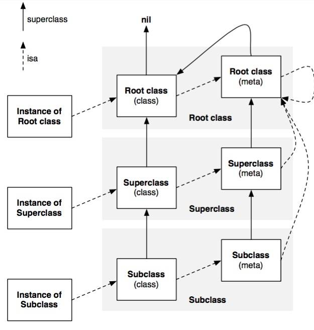
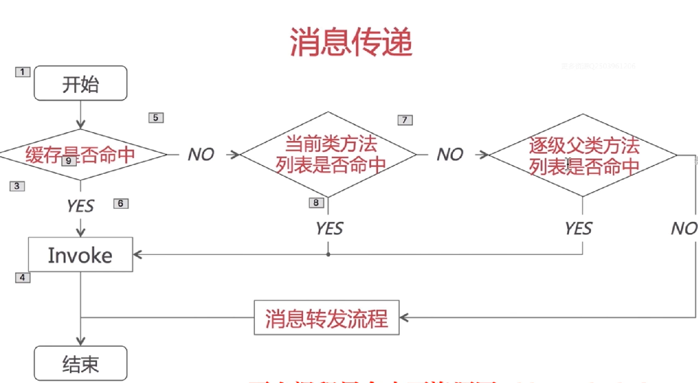
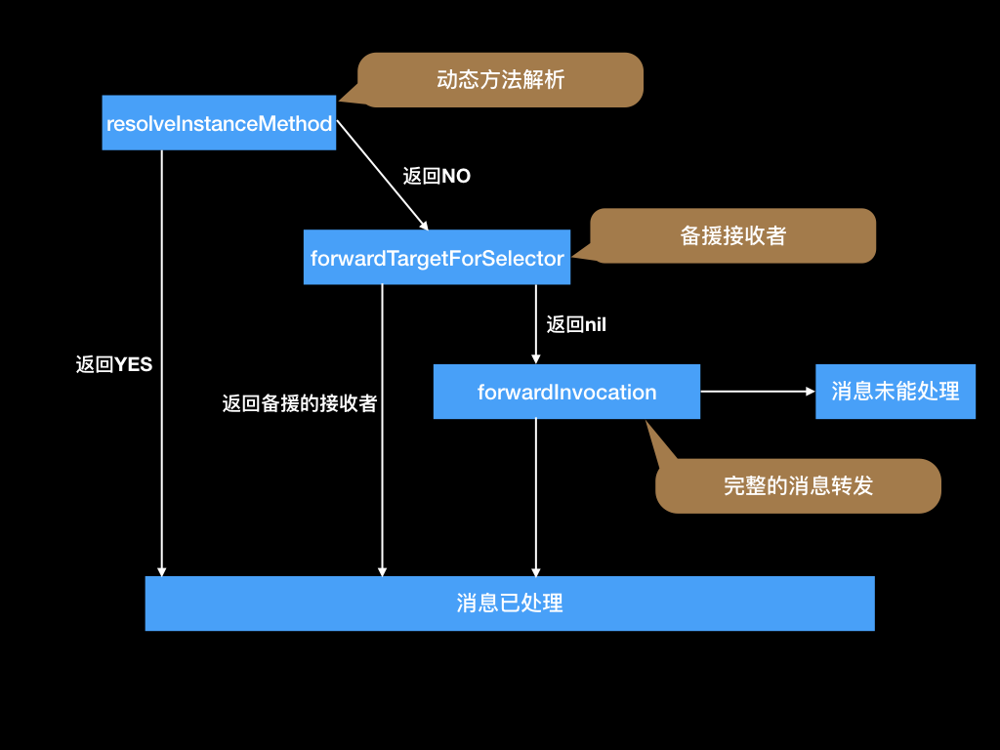
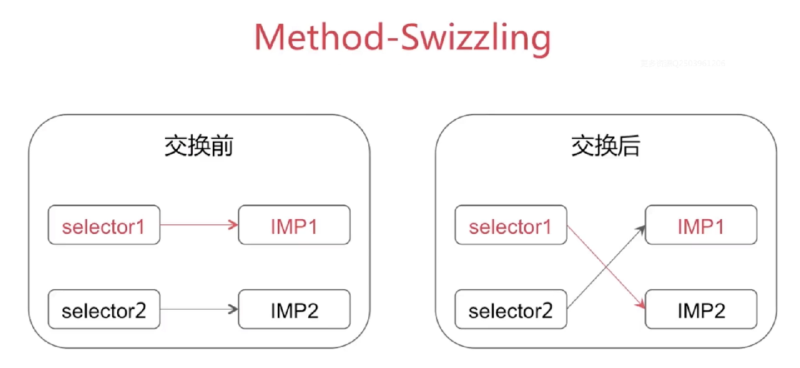

## 3. Rumtime

### 3.1 数据结构

#### 3.1.1 `objc_object`
`Objective-C`中面向对象指的是所有内容均是类（排除从C集成过来的结构体和基本数据类型）

`objc_object `结构体主要属性有:

- `isa_t` 实际上是一个共用体，
- `关于isa`操作相关
- `弱引用相关`
- `关联对象相关`
- `内存管理相关`

- 所有内容都是对象，对象皆是`ojbc_object`，而里面只有一个变量即`isa_t`指针。
- `isa_t`指针，里面存储了一些关于当前对象的信息，可能会使用优化， 即在64位系统，8字节的`isa_t`指针里面，只有33位是存储这个对象实际的地址，剩余的用来存储一些信息，例如使用使用cxx析构器（destructor），引用计数，是否有关联对象，是否使用弱引用计数表，是否正在dealloc等。

#### 3.1.1.1  指针优化--Tagged Pointer
对于一些本身值可能不需要8字节来表示，例如NSNumber，NSDate。在引用64位系统之后，如果用一个64位的地址存储一个数字，并且引入一个指针指向这个数字的话，存储空间会浪费会浪费很多。如今这个指针里面直接存储这个值，不仅省了空间还提升了效率。

#### 3.1.2 `objc_class`
OC中用`Class`来表示类对象，而`Class`实际上是`objc_class`,继承于`objc_object`,所以也是一个类对象

`objc_class`结构体主要属性有:

- `Class superClass`指向父类对象
- `cache_t cache`方法缓存的一个结构
- `class_data_bits_t bits`类的主要变量属性方法协议都在这个结构体里面

#### 3.1.3 `isa指针`

- 在64位结构下，`isa`指针分为
	- `指针型isa`
	- `非指针型isa`
- `isa指向`
	- 关于对象，其指向`类对象`
	- 关于类对象，其指向其`元类对象`

#### 3.1.4 `cache_t`

- 用于快速查找方法执行函数
- 是可增量扩展的哈希表结构
- 是`局部性原理`的最佳应用（类比CPU中也是有缓存，将常用的内容缓存起来）

`cache_t`的哈希表构造如何处理冲突：**开放地址法**

#### 3.1.5 `class_data_bits_t`

- `class_data_bits_t`主要是对`class_rw_t`的封装
- `class_rw_t`代表类的相关读写信息，还可以在运行时进行修改的
- `class_ro_t`代表类相关的只读信息，在编译时已经确认的

#### 3.1.6 `class_rw_t`
结构体包含的成员有:

- `class_ro_t`
- `protocols`
- `properties`
- `methods`

ps:`properties`,`protocols`,`methodList`在这里是二维数组，会在运行时将先最后编译的分类的内容添加到这个二维数组的前面，最后才将原来类中的`class_ro_t`的内容加上

[具体在2.1.3的分类的原理中有说明](https://github.com/dannyCaiHaoming/MyGitProfject/tree/master/iOS%E9%9D%A2%E8%AF%95%E5%87%86%E5%A4%87/2.OC%E8%AF%AD%E8%A8%80#213-%E5%88%86%E7%B1%BB%E7%9A%84%E5%8E%9F%E7%90%86)

#### 3.1.7 `class_ro_t`
结构体包含的成员有:

- `name`
- `ivars`声明或定义的成员变量
- `properties`属性
- `protocols`
- `methodList`

ps:`properties`,`protocols`,`methodList`是一维数组，在编译期间确认好

#### 3.1.8 `method_t`
函数四要素

- 名称
- 返回值
- 参数
- 函数体（实现）

实际上对应的是`method_t`的结构

- `SEL name`名称
- `const char* types`返回值和参数，使用`Type Encodings`
- `IMP imp`函数体

#### 3.1.9 整体数据结构

### 3.2 类对象与元类对象

- `类对象`存储实例方法列表等信息
- `元类对象`存储类方法列表等信息

### 3.3 消息传递

##### 3.3.1.1 `objc_msgSend `
OC中的函数调用叫做`消息传递`，原因是

    [self class];
    //等同于
    objc_msgSend(self,@selector(class));

​    
##### 3.3.1.2 `objc_msgSendSuper`

	[super class];
	//等同于
	objc_msgSendSuper(objc_super->receiver,@selector(class));

##### 3.3.1.3`objc_super`结构体，实际上消息接收者还是调用者本身

	stuct objc_super {
	__unsafe_unretained id receiver;//指向调用者本身
	}

#### 3.3.2 方法缓存
方法缓存查找的过程实际是一个`哈希查找`的过程

 - 使用`SEL`方法选择器，使用哈希算法，得出一个哈希值的`key`
 - `key`的值，其实是该方法在`bucket_t`数组中的索引位置

#### 3.3.3 当前类中查找

- 对于`已排序好`的列表，采用`二分查找`算法查找方法对应执行函数
- 对于`未排序`的列表，采用`一般遍历`方法查找对应执行函数

#### 3.3.4 当前类的`SuperClass`逐级进行`查找缓存`和`类中查找`

 

### 3.5 消息转发
[参考：iOS开发·runtime原理与实践](https://juejin.im/post/5ae96e8c6fb9a07ac85a3860#heading-16)

[参考：深入浅出理解消息的传递和转发机制](https://www.cnblogs.com/zhanggui/p/7731394.html)

#### 3.5.1 动态方法解析：Method Resolution
OC运行时调用`+ (BOOL)resolveInstanceMethod:`或者 `+ (BOOL)resolveClassMethod:`，让你有机会提供一个函数实现

#### 3.5.2 快速转发：Fast Forwarding
OC运行时通过调用`- (id)forwardingTargetForSelector:(SEL)aSelector`,允许你替换信息的接收者为其他对象

#### 3.5.3 完整消息转发：Normal Forwarding
- `- (NSMethodSignature *)methodSignatureForSelector:(SEL)aSelector`先获得一个方法签名
- `- (void)forwardInvocation:(NSInvocation *)invocation `将方法签名传过来的`NSInvocation`进行处理

#### 3.5.4 Fast Forwarding对比Normal Forwarding

- 需要重载的API不同
- 转发的对象个数不一样
	- 前者只能指定一个，后者可以自定义多个

### 3.6 Method-Swizzling（方法混淆）
实际上是修改选择器(`SEL`)对应的方法实现(`IMP`)

### 3.7 动态添加方法

	//使用消息转发第一阶段运行时添加方法。
	+ (BOOL)resolveInstanceMethod:(SEL)sel{
		if (){
		  class_addMethod(self,@selector(test),testIMP,"V@:");
		  return YES;
		}
		return [super resolveInstanceMethod:sel];
	}

### 3.8 动态方法解析

**@dynamic**

- 动态运行时语言将函数决议推迟到运行时
- 编译时语言在编译期进行函数决议

### 3.9 load和initialize

+load():
 会在程序第一次加载到内存的时候，main函数执行前调用，且只会执行一次。与这个类是否使用到无关。

 1.load方法执行的顺序是`根类-父类-子类-分类`,且根据编译顺序
 2.该方法不会继承
 3.不需要调用[super load]
 4.分类的拼接会在load方法执行之前

+initialize
 会在对象创建的时候调用一次，就是懒加载的机制。并且只会执行一次。
 1.initialize的执行顺序是`根类-父类-子类`，如果分类重写了，则会被覆盖
 2.该方法会被继承，如果子类没有实现，则会调用父类
 4.分类中如果重写了该方法，则会被覆盖。
 3.不需要调用[super initialize]

#### 3.10 面试题

- 能否像编译后的类中增加实例变量

1. [self class] & [super class]分别输出是什么？
	[self clsss] 方法，类对用即返回自己，对象即返回isa指向的类
2. isKindOfClass & isMemberOfClass
	a.isKindOfClass第一步先找isa指向的是否相等，然后循环遍历superClass指针指向的内容来判断
    - +()isKindOfClass,会先从类的元类开始，然后每次找元类的父类
	- -()isKindOfClass，从对象的类开始，然后每次找父类 
	b.isMemeberOfClass只会找一次isa指针指向的内容来判断
	- +()isMemberOfClass,即拿类的isa指针跟后面的内容判断是否相等 
	- -()isMemberOfClass,即拿对象的类来跟后面的内容判断是否相等