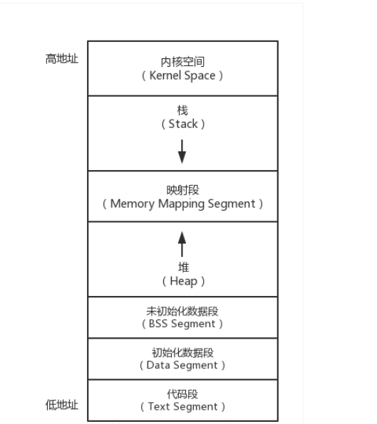
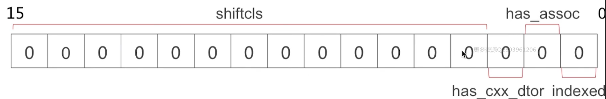
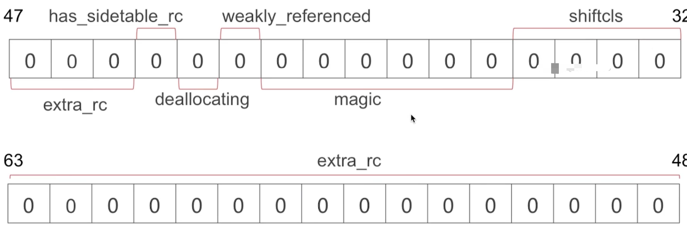
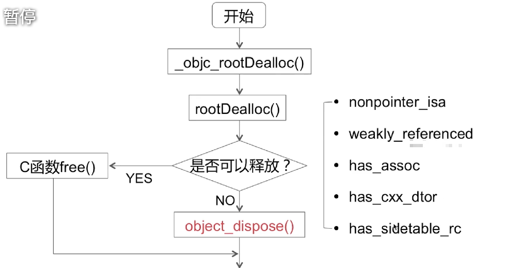
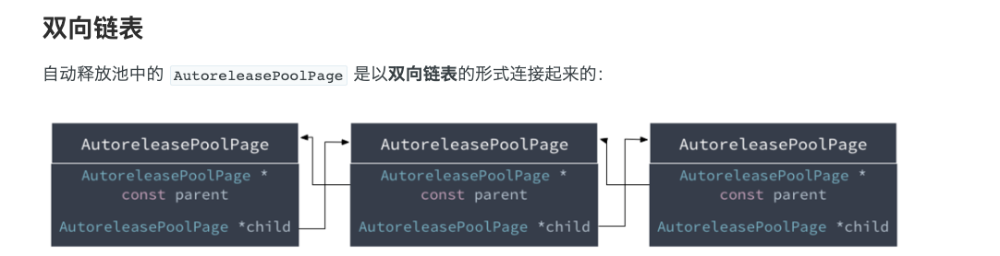
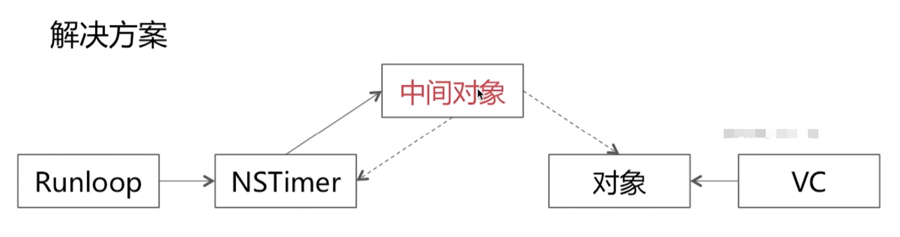

## 4 内存


### 4.1 内存布局

[参考：程序内存布局](https://cloud.tencent.com/developer/article/1177538)



从低地址往高地址：

- `.text(代码段)`：存放的是成程序编译好的代码段
- `.data(已初始化数据段)`：存放已经初始化的全局变量或者静态变量
- `.bss(block storage segment)(未初始化数据段)`：存放未初始化的全局变量或静态变量
- `堆`：用于程序执行中，分配和销毁空间，用于存放程序执行中的变量，是`不连续的内存区域`
- `栈`：存储方法调用过程中的上下文，还有方法中的内部临时变量，程序在调用函数时，系统会自动调用压栈和弹栈完成保存函数现场的操作。栈是一块`连续的内存区域`


#### 4.1.1 `NSString`内存中的位置

```

NSString *a = @"123";

NSString *b = [@"123" stringByAppendingString @"456"];

NSMutableString *c = [NSMutableString stringWithString:@"123"];

```

-  常量，我们经常初始化的时候`NSString *a = @"123";`如是。在编译过程中，`"123"`已经存储在常量区，只要我们的字符串内容不进行改变，这个内容的地址就是在初始化的数据段中的常量区。我们初始化的对象`a`如果是在对象中或者函数中使用，那么这个对象或说指针不过是在栈上创建的。
-  在堆中创建。当我们使用可变的字符串即`a + b`或`NSMutableString`，所创建的内容是在堆上的，即跟我们手动`alloc`

### 4.2 内存管理方法

#### 4.2.1 `TaggedPointer`

专门用于存储小对象的，例如`NSNumber`和`NSDate`，存储的不是对象，而是直接是值

#### 4.2.2 ==NONPOINTER_ISA==




- 在`arm64`架构下
	- 第1位，表示是否是指针型的`isa`指针，如果是非指针型的`isa`
	- 第2位，表示是否存在关联对象
	- 第3位，表示使用使用c++的内容
	- 接着后面33位，`shiftcls`，表示类对象地址
	- 有个不重要的magic
	- 标识是否存在弱引用指针
	- 是否正在进行`deallocating`
	- 是否使用额外的引用数表
	- 剩下的是引用计数值


#### 4.2.3 ==散列表==

- `SideTables()`结构
	- 包含64个`SideTable`，其实每一个都是一个`哈希表`

- `SideTable`结构
	- ==spinlock_t==自选锁
	- ==RefcountMap==引用计数表
	- ==weak\_table\_t==弱引用表

为什么不是使用一个`SideTable`:由于需要保证线程安全，那么当对这个`SideTable`操作的时候，就需要进行上锁处理，如果需要操作这个表的对象多的时候，就会陷入大部分时间都在等待锁。

- ==分离锁==

	`引用计数表`中引入了`分离锁`的概念，将一张表分拆成多个部分，对他们分别加锁，可以实现并发操作，提升执行效率
	- 每个`SideTable`中有一个`引用计数表`,在同一组中的8个`引用计数表`可以并发操作，若是分成8个锁，就需要串行进行处理。


- 如何快速根据一个对象查找对应`SideTable`----`哈希查找`
	- 根据`对象指针`，使用`Hash`函数，生成一个`key`,是`SideTables`中的数组下标


##### 4.2.3.1 Spinlock_t

- ==Spinlock\_t==是“忙等”的锁，如果这个锁被其他线程锁上了，当前线程会一直尝试获取，一直占有运行。
- 适用于轻量访问

#### 4.2.3.2 ==引用计数表==

- 使用`对象地址`进行`哈希算法`得到`key`，在`引用计数表`中查询得出`size_t`，进行获取和插入

- `size_t`,`unsign long`,实际是引用计数值
- 在全局SideTable中获取RefcountMap另一个散列表。
- 然后从RefcountMap中根据对象的地址，获取size_t引用计数


#### 4.2.3.3 ==弱引用表==

- 使用`对象地址`进行`哈希算法`得到`key`，在`弱引用表中`可以查询出==weak\_entry\_t==

- `weak_entry_t`实际是一个数组，存储着指向该对象的`弱引用指针`


### 4.3 MRC & ARC

#### 4.3.1 MRC ---- 手动引用计数

- `alloc`
- `dealloc`
- ==retain==
- ==release==
- ==retainCount==
- ==autorelease==

#### 4.3.2 ARC ---- 自动引用计数

- ARC是==LLVM==和==Runtime==协作的结果
- ARC中禁止手动调用上面特殊标记的关键字
- ARC中新增==weak==,==strong==关键字

#### 4.3.3 ARC --- 优化

- id objc_autorelease(id value);

  放入自动释放池

- id objc_retainAutorelease(id value);

  先调用retain，再放入自动释放池

- id objc_autoreleaseReturnValue(id value);

  根据返回值，先判断是否需要加入自动释放池，需要的话先加入自动释放池，

  不需要就直接返回

- id objc_retainAutoreleaseReturnValue(id value);

  先调用retain，然后走`objc_autoreleaseReturnValue`

- id objc_retainAutoreleasedReturnValue(id value);

  根据返回值，判断是否需要`retain`，需要就调用`retain`，不需要就直接返回

​        ARC中，本来我们需要在需要持有的地方调用`retain`，不需要的地方调用`release`，但如果在一个较大的工程中，这样做就会导致低效的问题。所以编译器的开发者对这类问题进行了很多优化，其中一个优化方式就是避免插入过多的`retain/release`。 `retain`-`release`优化的原理，就是根据返回值的引用，例如

```objectivec
// 由于返回值需要由obj持有，因此实际用的是objc_retainAutoreleasedReturnValue，且最终需要obj来释放
id obj = [TestObject foo];
```

```objectivec
// 由于返回值不存在持有，因此需要在返回值中自动释放。因此用的是objc_autoreleaseReturnValue
[TestObject foo];
```

​		


### 4.4 引用计数管理

#### 4.4.1 实现分析

- `alloc`
	- 只是调用C函数的`calloc`
	- 此时并没有对引用计数设置为1


- `retain`
	- 先在`SideTables`中查找到`SideTable`
	- 获取`SideTable`中`引用计数表`属性
	- 在`引用计数表`中，使用`哈希查找`到`size_t`，进行`+1`操作

			-(void)setName:(NSString *)name{
    		//如果不判断，可能会把原来对象释放
    	      if (_name != name) {
    	       [_name release];
    	       _name = [name retain];
    	    	}
    	    }

**PS**:由于`引用计数值`是从`第3位`开始，因此`+1`操作等于`+0x4`,获取引用计数值也需要先`右移2位`


- `release`
	- 跟上面前两步一样，最后一步做`-1`操作


- `retainCount`
	- 显示通过`哈希算法`在`SideTables`中查找到`SideTable`
	- 然后会有一个`refcnt_result=1`的局部变量
	- 然后会到`引用计数表`中查询**是否存在表示引用计数值**
	- 最终结果是将这个`引用计数值`加上`refcnt_result`

**PS**:因此，一开始这个对象在刚创建且没有被引用时，返回的值其实是默认的`refcnt_result`的局部变量值（默认值），没有设置到`引用计数表`中的值。


- `dealloc`




### 4.5 弱引用管理

- 添加weak变量：weak指针，以及weak指针指向的对象地址
		根据对象地址，使用哈希算法在SideTables找到SideTable，并且根据对象地址找到`weak_table_t`，以对象地址使用哈希查找找到`weak_entry_t`，将weak指针地址存储到这个类似数组的`weak_entry_t`结构中

- weak指向的对象被销毁时，指向该对象的weak指针自动置为nil
		跟上面类似，会根据对象地址使用哈希算法寻找到`weak_entry_t`,然后将这个弱引用指针数组全部置为nil


### 4.6 自动释放池(在内存堆中创建，低地址往高地址)

[参考：自动释放池的前世今生](https://draveness.me/autoreleasepool)

- 是以==栈==为节点，通过==双向链表==的形式结合而成
- 是和==线程==一一对应

#### 4.6.1 `AutoreleasePool`的实现原理是怎样？



#### 4.6.2 `AutoreleasePool`为何可以嵌套使用？

- autoreleasepool本来是一个双向链表，在调用@autoreleasepool嵌套的时候，其实在push，pop之间写逻辑代码
- push的时候会生成一个autoreleasepool，且将哨兵对象插入到当前页中，然后以下一个可插入地址作为返回。
- 因此如果嵌套的时候，其实就是一层用一个哨兵管理，只要每层都pop到自己的哨兵对象处，就不会乱。

- push到pool的时候
  - 不满，直接添加
  - 满了，从循环寻找child不满的添加
  - 没有pool，直接创建，先加了个哨兵再添加

- runloop和autoreleasepool的关系
  - 旧版本的main函数，是@autoreleasepool包裹着UIApplication的代码，因此这一层需要等到程序退出才会释放
  - 然后主线程的runloop维护了一个autoreleasepool，即在runloop即将进入和即将退出的时候，调用push和pop的方法
  - 此外对于需要arc手动添加release，retain，autorelease的对象，会在runloop即将进入，即将休眠，即将唤醒，退出。
    - 即将进去，push一个哨兵
    - 即将休眠，将哨兵之前的pop出来release了，然后再push一个哨兵
    - 退出将哨兵之前的pop出来release了

- 在当次`runloop`将要结束的时候调用`AutoreleasePoolPage::pop()`
- 多层嵌套就是多次插入`哨兵对象`
- 在for循环中alloc图片数据等内存消耗较大场景手动插入`autoreleasepool`


### 4.7 循环引用


#### 4.7.1 循环引用分类

- 自循环引用
对象跟成员对象之间
- 相互循环引用
对象A的成员是对象B，对象B的成员是对象A
- 多循环引用

#### 4.7.2 如何破除循环引用？

- 避免产生循环引用
	- `__weak`
	- `__block`

- 合适时机手动断环


#### 4.7.3 NSTimer的循环引用问题



- 增加中间对象
- 在timer回调中销毁timer


### 4.8 内存对齐

#### 4.8.1 什么是内存对齐
就是数据不是散散，空间剩多少都能按百分比装进去，而是剩余空间要么能装进，不能就另外开辟空间放进去。因此这个也会产生一个结构布局的优化问题。例如两个`int`,一个`char`，不同顺序的话，占用的内存空间也是不一样的，这个就是内存对齐导致的。

```
struct s1{
	char y1;
    int x;
    char y2;
};

struct s2{
	char y1;
	char y2;
    int x;
};

int main()
{
    printf("%d\n",sizeof(s1);  // 输出12
	printf("%d\n",sizeof(s2);  // 输出8
    return 0;
}
```

#### 4.8.2  为什么要内存对齐
反例就是：一个`int`数据的4个字节可以随意存放，就变成需要读取多次不同的块，浪费大量内存读写和传输，浪费很多时间和空间。

#### 4.8.3 内存对齐规则（重要的一笔）
- `数据成员对齐规则`:结构体第一个成员的`偏移量`为0，以后每个数据成员的对齐按照`#pragma pack指定的数值`和`这个数据成员自身长度`中，比较小的那个进行。
- `结构(或联合)的整体对齐规则`:在数据成员完成各自对齐后，结构体本身也要进行对齐，对齐将按照`#pragma pack指定的数值`或`结构<最大数据成员长度中，比较小的那个>`
- 结构体总大小为`结构体最宽基本成员大小的整倍数`

人话：
第一个集装箱从0开始装，每个集装箱的容量为（指定数值或者最大数据成员长度中小的那个），然后一个个集装箱内容能否装满，剩余的容量看看后面的数据能不能装进去，不能就继续开下一个。如此类推

#### 4.8.4 结构体中的内存对齐 （用一个个集装箱来类比块）
**结构内对齐大小，还会选择`#pragma pack`和较大的成员中较小的一个**
1. 第一个成员`偏移量`为0，然后比较当前成员的大小和`#pragma pack`指定大小，用最小的那个作为单位，若一个装不完则需要多开一个。
2. 第二个成员会从上一个成员用剩的箱子开始，如果剩下的空间装不下，则需要再另外开一个。然后重复第一步。

#### 4.8.5 `NSObject`内部默认对齐大小为8个字节。
即不会应用`选择pragma pack和较大的成员中较小的一个`这个规则
```
#pragma pack(push,2)
@interface Axxxx : NSObject {
    struct xxxx3 x3; // 为5个字节的内容
    void *p;
    char c;
}
@end
#pragma pack(pop)
// 最终输出是32. 一个isa指针，一个5字节内容，一个isa指针，一个1字节的char
// 如果是放到结构体中，则是16
```


#### 2.7.4 `浅拷贝`是指针复制，`深拷贝`是内容复制

Q：**用@property声明的NSString（或NSArray，NSDictionary）经常使用copy关键字，为什么？如果改用strong关键字，可能造成什么问题？**

- 使用`strong`进行指针赋值操作的时候，会简单的进行指针赋值，如果这个时候，本来希望这个`NSArray`是不可变的话，但是赋值一方传入了`NSMutableArray`对象，(NSArray有可变子类NSMutableArray)并且在其他地方进行了修改，那么`self.array`就可能被修改了

Q: **NSMutable对象，经常使用strong关键字，为什么**

- 原因是如果使用copy对象，那么无论使用何种方式进行赋值，那么这个`self.mArray`都是得到一个不可变对象，如果在后续代码相对此可变数组进行操作，那么就会出现不可变数组找不到可变数组的方法。

#### 2.7.5 Copy和MutableCopy

copy本质是复制内容，使得源对象和复制对象二者互不影响。所以基于此逻辑，可以得到不可变对象使用copy的时候，由于本来内容不可变，因此复制对象也不需要变化，所以可以直接是指针复制（浅复制）。如果是可变对象，那么由于源对象可变，当使用copy方法得到不可变对象的时候，也是需要另外开辟空间。而使用mutableCopy得到可变对象，也同样需要另外开辟空间，为了源对象不会影响复制对象，所以可变对象的复制都是深复制。

    NSArray *arr1 = [NSArray arrayWithObject:@"arr1"];
    NSMutableArray *mArr1 = [NSMutableArray arrayWithObject:@"mArr1"];
    
    NSLog(@"inArray copy---%@",[[arr1 copy] class]);
    NSLog(@"inArray mutableCopy---%@",[[arr1 mutableCopy] class]);
    
    NSLog(@"mArray copy---%@",[[mArr1 copy] class]);
    NSLog(@"mArray mutableCopy---%@",[[mArr1 mutableCopy] class]);


​	 
​	inArray copy---__NSSingleObjectArrayI
​	inArray mutableCopy---__NSArrayM
​	mArray copy---__NSSingleObjectArrayI
​	mArray mutableCopy---__NSArrayM

**结论：**

- `copy` 浅复制，都是得到不可变对象
  - 并且数组的内容也是指针引用
- `mutableCopy`深复制，都是可变对象
  - 数组内容的地址还是原来的，可以遍历每个元素进行copy，或者调用创建方法有个copyitem的。

连着一起记忆：

- `copy`，作为修饰词，或者方法调用，得到的都是不可变对象
- `mutableCopy`或者`strong`修饰的得到的都是可变对象
