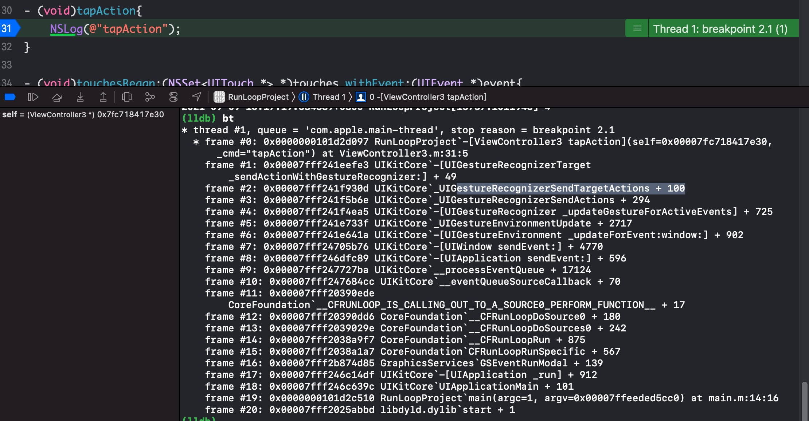

### RunLoop

从几方面开始讲解：

1. 什么是RunLoop
2. RunLoop的作用
3. RunLoop的结构
4. RunLoop与线程的关系
5. Runloop相关类及作用
6. Runloop的核心逻辑
7. RunLoop的应用


### 什么是RunLoop

从字面意思联想，运行循环。即通过一个事件循环达到一个应用可以保持一直运行而不退出，可以时刻等待用户的输入以及操作，让程序可以在有事情做的时候做事情，在没有事情做的时候等待。达到节省cpu资源，提高程序性能。


### Runloop的基本作用

1. 保持程序持续运行。程序启动时会跑起一个主线程对应的Runloop，Runloop保证主线程不会被销毁，也保证了程序的持续运行。
2. 处理app中的各种事件，例如触摸事件、定时器事件、延时的Selector事件
3. 节省CPU资源，提高程序性能。程序运行时，当什么操作都没有做的时候，Runloop就告诉CPU，现在没有事情做，我去休息，这时CPU就会将资源释放出来去处理其他事情，当有事情做的时候，Runloop就会立马起来去做事情。


### Runloop在哪里开启

在UIApplicationMain函数上下插入打印发现，只会输出上面，下面的需要等到程序结束才会打印。因此可以知道主线程的Runloop是在UIApplicaMain函数中开启的，开启了一个与主线程相关的Runloop，导致UIApplicationMain不会返回，一直在运行中，也就保证了程序的持续运行。

### Runloop对象

- CoreFoudation框架下是CFRunLoopRef对象

- Foundation框架下是NSRunLoop对象，是基于CoreFoundation下的CFRunloopRef的封装对象

  

  ```objective-c
  //Foundation
  [NSRunLoop currentRunLoop];
  [NSRunLoop mainRunLoop];
  //CoreFoundation
  CFRunLoopGetCurrent();
  CFRunLoopGetMain();
  ```

  

  ### RunLoop和线程的关系

  1. 每条线程都有唯一一个与之对应的RunLoop对象
  2. RunLoop保存再一个全局的Dictionary里，线程作为key，RunLoop作为value
  3. 主线程的RunLoop自动创建好，子线程的RunLoop需要主动创建
  4. RunLoop在第一次获取时创建，在线程结束是销毁

```objective-c
//1.获取主线程的RunLoop，只能通过主线程来获取，并不能生成
CFRunLoopRef CFRunLoopGetMain(void)
{
    CHECK_FOR_FORK();
    static CFRunLoopRef __main = NULL; // no retain needed
    if (!__main)
        __main = _CFRunLoopGet0(pthread_main_thread_np()); // no CAS needed
    return __main;
}
//2.获取RunLoop的时候，是需要根据当前线程来获取
CFRunLoopRef CFRunLoopGetCurrent(void)
{
    CHECK_FOR_FORK();
    CFRunLoopRef rl = (CFRunLoopRef)_CFGetTSD(__CFTSDKeyRunLoop);
    if (rl)
        return rl;
    return _CFRunLoopGet0(pthread_self());
}

//3.根据线程作为key，在一个全局的字典里面查找对应的RunLoop，如果没有则先创建。
//同时能够发现，主线程的RunLoop是一开始创建字典的同时会跟主线程RunLoop一起创建的。
CF_EXPORT CFRunLoopRef _CFRunLoopGet0(pthread_t t)
{
    if (pthread_equal(t, kNilPthreadT))
    {
        t = pthread_main_thread_np();
    }
    __CFLock(&loopsLock);
    if (!__CFRunLoops)
    {
        __CFUnlock(&loopsLock);
        /*
    注解：
    1.创建字典，key是pthread线程，value是runloop
    2.新版修改了默认会根据main_thread创建mainLoop
    3.然后再根据输入的pthread在字典里面获取runloop，如果不存在即会创建
    4.runloop并不会预先存在，在获取的时候才会去创建。
    */
        CFMutableDictionaryRef dict = CFDictionaryCreateMutable(kCFAllocatorSystemDefault, 0, NULL, &kCFTypeDictionaryValueCallBacks);
        CFRunLoopRef mainLoop = __CFRunLoopCreate(pthread_main_thread_np());
        CFDictionarySetValue(dict, pthreadPointer(pthread_main_thread_np()), mainLoop);
        if (!OSAtomicCompareAndSwapPtrBarrier(NULL, dict, (void *volatile *)&__CFRunLoops))
        {
            CFRelease(dict);
        }
        CFRelease(mainLoop);
        __CFLock(&loopsLock);
    }
    CFRunLoopRef loop = (CFRunLoopRef)CFDictionaryGetValue(__CFRunLoops, pthreadPointer(t));
    __CFUnlock(&loopsLock);
    if (!loop)
    {
        CFRunLoopRef newLoop = __CFRunLoopCreate(t);
        __CFLock(&loopsLock);
        loop = (CFRunLoopRef)CFDictionaryGetValue(__CFRunLoops, pthreadPointer(t));
        if (!loop)
        {
            CFDictionarySetValue(__CFRunLoops, pthreadPointer(t), newLoop);
            loop = newLoop;
        }
        // don't release run loops inside the loopsLock, because CFRunLoopDeallocate may end up taking it
        __CFUnlock(&loopsLock);
        CFRelease(newLoop);
    }
    if (pthread_equal(t, pthread_self()))
    {
        _CFSetTSD(__CFTSDKeyRunLoop, (void *)loop, NULL);
        if (0 == _CFGetTSD(__CFTSDKeyRunLoopCntr))
        {
            _CFSetTSD(__CFTSDKeyRunLoopCntr, (void *)(PTHREAD_DESTRUCTOR_ITERATIONS - 1), (void (*)(void *))__CFFinalizeRunLoop);
        }
    }
    return loop;
}

```

从上面可以知道，线程和RunLoop之间是一一对应的，其关系是保存在一个全局的Dictionary里。所以我们创建子线程RunLoop时，只需要在子线程中获取当前线程的RunLoop对象即可。如果不获取，则子线程不会主动创建与之相关的RunLoop，并且只能在一个线程内部获取其RunLoop,。


### RunLoop结构体

```objective-c
/*
注解：
1.一个Runloop包含若干个RunloopMode
2.每个RunloopMode包含若干个source,observer,timer 
3.这些RunloopMode统称为mode item
    - 一个item可以进入多个model，但是item重复加入同一个model不会有效
    - 一个runloop没有item，则直接会退出，不会循环---判断方法为__CFRunLoopModeIsEmpty
4.commonModes:意思是标记当前runloop状态发生变更时，通知的runloopmode更新对象。
    - 例如主线程默认有kCFRunLoopDefaultMode和UITrackingRunLoopMode，当正常添加到default的timer，
        当app进行tableview滑动，主线程的runloop切换到UITrackingRunLoopMode时，default里面的mode item是不会被吊起执行的
*/
struct __CFRunLoop
{
    CFRuntimeBase _base;
    pthread_mutex_t _lock; /* locked for accessing mode list */
    __CFPort _wakeUpPort;  // used for CFRunLoopWakeUp
    Boolean _unused;
    volatile _per_run_data *_perRunData; // reset for runs of the run loop
    pthread_t _pthread;
    uint32_t _winthread;
    CFMutableSetRef _commonModes;
    CFMutableSetRef _commonModeItems;
    CFRunLoopModeRef _currentMode;
    CFMutableSetRef _modes;
    struct _block_item *_blocks_head;
    struct _block_item *_blocks_tail;
    CFAbsoluteTime _runTime;
    CFAbsoluteTime _sleepTime;
    CFTypeRef _counterpart;
};
```

这里主要是关注

- `CFRunLoopModeRef _currentMode`

- `CFMutableSetRef _modes`

CFRunLoopModeRef 其实是指向__CFRunLoopMode结构体的指针

```objective-c
/*
注解：
1.RunLoop包含多个RunloopMode包含多个source，observer,timer
2.source0: 怎么得到只傲寒一个回调（函数指针）？并不能主动触发事件
3.source1: 包含一个mach_port和一个回调，被用于内核和其他线程相互发送消息。能主动唤醒rooploop线程
4.observer: 观察者，每个Observer都包含一个回调，当Runloop状态发生变化的时候，会接收到通知。
    - kCFRunLoopEntry
    - kCFRunLoopBeforeTimers
    - kCFRunLoopBeforeSources
    - kCFRunLoopBeforeWaiting
    - kCFRunLoopAfterWaiting
    - kCFRunLoopExit
5.timers:基于时间的触发器。包含一个时间长度和回调，当加入runloop的时候，会在注册对应时间点，当时间点到来时runloop被唤醒去执行相应的回调。和timer可以直接桥接
*/
struct __CFRunLoopMode
{
    CFRuntimeBase _base;
    pthread_mutex_t _lock; /* must have the run loop locked before locking this */
    CFStringRef _name;
    Boolean _stopped;
    char _padding[3];
    CFMutableSetRef _sources0;
    CFMutableSetRef _sources1;
    CFMutableArrayRef _observers;
    CFMutableArrayRef _timers;
    CFMutableDictionaryRef _portToV1SourceMap;
    __CFPortSet _portSet;
    CFIndex _observerMask;
#if USE_DISPATCH_SOURCE_FOR_TIMERS
    dispatch_source_t _timerSource;
    dispatch_queue_t _queue;
    Boolean _timerFired; // set to true by the source when a timer has fired
    Boolean _dispatchTimerArmed;
#endif
#if USE_MK_TIMER_TOO
    mach_port_t _timerPort;
    Boolean _mkTimerArmed;
#endif
};
```


#### Source0 / Source1

- Source1 :基于Port的线程间通信
- Source0：触摸事件，PerformSelector




手势识别和事件响应二者可以联系在一起记忆。

前面由`SpringBoard`进程接收到用户手势，跨进程使用主线程的`Source1`接收到消息后，等到下一轮的`RunLoop`流程继续从`GSEventRunModal`到`Source0`处理`HIDEvent`->`UIEVent`转换后的传递。手势识别的话，将直接通过`Recognizer`进行`target-action`响应。如果是普通`touchBegan`事件，则需要进行视图响应传递。


#### 响应事件

首先是由系统的`SpringBoard`进程接收并且处理的，里面通过`IOHIDService`(Human Interface Devices)，主要分管人机交互方面的事件。然后通过进程间通讯`mach port`的手段，将这个IO事件传递到需要用的进程。我们在使用的app，由于会在主线程上开启一个`source1`的监听，随后在这个`source1`的回调里面，由内部`__IOHIDEventSystemClientQueueCallback`会把`IOHIDEvent`处理包装成`UIEvent`然后由应用进行派发。之后`RunLoop`会在下一次循环将走到`Source0`触发后面的事件传递流程，直到找到合适的视图进行`touch`事件响应。  ----`_UIApplicationHandleEventQueue()`会把 IOHIDEvent 处理并包装成 UIEvent 进行处理或分发

#### 手势识别

同样是上面的跨进程通讯之后，会在回调里面调起`_UIGestureRecognizerUpdateObserver`,这个`Observer`回调函数内部会获取所有刚被标记为待处理的`GestureRecognizer`,并通过`target-action`进行消息传递。


#### PerformSelector延时


#### Timer


#### Observer


### RunLoop相关类及其作用


- CFRunLoopRef 获取当前RunLoop和主RunLoop

- CFRunLoopModeRef RunLoop运行模式，只能选择一种，在不同模式做不同操作

- CFRunLoopSourceRef  事件源，输入源

- CFRunLoopTimerRef 定时器

- CFRunLoopObserverRef 观察者

#### CFRunLoopModeRef - 代表RunLoop的运行模式

一个RunLoop包含若干mode，每个mode包含若干个Source、Timer、Observer。每次RunLoop启动只能指定一个mode，这个mode被称作`currentMode`。如果需要切换mode则只能退出RunLoop，再重新指定一个mode进入。这样做主要是为了分隔开不同组的Source、Timer、Observer，让其互不影响。如果Mode里面没有任何Source、Timer，RunLoop会立马退出。


##### 系统默认注册的5个mode

- KCFRunLoopDefaultMode: App的默认mode，通常主线程在这个mode下运行
- UITrackingRunLoopModel： 界面追踪mode，用于追踪触摸滑动，保证界面滑动不受其他影响。
- UIInitializationRunLoopMode: 在刚启动App时第一个进入的mode，启动完成后，不再使用
- GSEventReceiveRunLoopMode：接受系统事件的内部mode
- kCFRunLoopCommonModes: 占位用的mode，作为标记KCFRunLoopDefaultMode和UITrackingRunLoopModel


##### Mode间的切换

主线程下的NSTimer和UIScrollView。需要将Timer加入到当前的RunLoop中，一般加入的是`kCFRunLoopDefaultMode`。然后当UIScrollView滑动的时候，主线程的RunLoop会切换到UITrackingRunLoopMode.正确的做法，是需要将Timer添加到`RunLooopCOmmonModes`这样这些`Items`就会归结为在`**common mode items**`下面，可以在不同mode切换的时候仍然响应。


##### CFRunLoopSourceRef 事件源和输入源

- source0: 应用内部事件更新，例如timer触发、PerforSelectorAfter事件处理，还有手势识别事件响应收到`Source1`回调之后的触发回调
- Source1：通过mach_port通讯，一般即是指定端口发消息，一般是系统的IO对事件封装好发到需要使用的应用端。但是这个应该应用内线程通讯也是可以使用的。


##### CFRunLoopObserverRef

CFRunLoopObserverRef是观察者，能够监听RunLoop的状态改变

```objective-c
//创建监听者
     /*
     第一个参数 CFAllocatorRef allocator：分配存储空间 CFAllocatorGetDefault()默认分配
     第二个参数 CFOptionFlags activities：要监听的状态 kCFRunLoopAllActivities 监听所有状态
     第三个参数 Boolean repeats：YES:持续监听 NO:不持续
     第四个参数 CFIndex order：优先级，一般填0即可
     第五个参数 ：回调 两个参数observer:监听者 activity:监听的事件
     */
     /*
     所有事件
     typedef CF_OPTIONS(CFOptionFlags, CFRunLoopActivity) {
     kCFRunLoopEntry = (1UL << 0),   //   即将进入RunLoop
     kCFRunLoopBeforeTimers = (1UL << 1), // 即将处理Timer
     kCFRunLoopBeforeSources = (1UL << 2), // 即将处理Source
     kCFRunLoopBeforeWaiting = (1UL << 5), //即将进入休眠
     kCFRunLoopAfterWaiting = (1UL << 6),// 刚从休眠中唤醒
     kCFRunLoopExit = (1UL << 7),// 即将退出RunLoop
     kCFRunLoopAllActivities = 0x0FFFFFFFU
     };
     */
    CFRunLoopObserverRef observer = CFRunLoopObserverCreateWithHandler(CFAllocatorGetDefault(), kCFRunLoopAllActivities, YES, 0, ^(CFRunLoopObserverRef observer, CFRunLoopActivity activity) {
        switch (activity) {
            case kCFRunLoopEntry:
                NSLog(@"RunLoop进入");
                break;
            case kCFRunLoopBeforeTimers:
                NSLog(@"RunLoop要处理Timers了");
                break;
            case kCFRunLoopBeforeSources:
                NSLog(@"RunLoop要处理Sources了");
                break;
            case kCFRunLoopBeforeWaiting:
                NSLog(@"RunLoop要休息了");
                break;
            case kCFRunLoopAfterWaiting:
                NSLog(@"RunLoop醒来了");
                break;
            case kCFRunLoopExit:
                NSLog(@"RunLoop退出了");
                break;
                
            default:
                break;
        }
    });
    
    // 给RunLoop添加监听者
    /*
     第一个参数 CFRunLoopRef rl：要监听哪个RunLoop,这里监听的是主线程的RunLoop
     第二个参数 CFRunLoopObserverRef observer 监听者
     第三个参数 CFStringRef mode 要监听RunLoop在哪种运行模式下的状态
     */
    CFRunLoopAddObserver(CFRunLoopGetCurrent(), observer, kCFRunLoopDefaultMode);
     /*
     CF的内存管理（Core Foundation）
     凡是带有Create、Copy、Retain等字眼的函数，创建出来的对象，都需要在最后做一次release
     GCD本来在iOS6.0之前也是需要我们释放的，6.0之后GCD已经纳入到了ARC中，所以我们不需要管了
     */
    CFRelease(observer);
```


### RunLoop处理逻辑

1. 用指定的mode启动`CFRunLoopRunSpecific`，然后调用`__CFRunLoopRun`

2. 整理起来就是

- 指定runloopmode启动

- 通知observers：RunLoop进入一个循环
  - 通知observers：即将出发Timer回调

  - 通知observers：即将触发Source0回调
  - 执行RunLoop的block
  - 执行Source0的block
  - 检查是否有Source1的事件

  - 进入休眠
  - 处理Timer事件
  - 处理GCD main dispatch事件
  - 处理Source1事件
  - 执行RunLoop的block
  - 判断循环处理结果标志位

- 通知observers:RunLoop退出一个循环


### RunLoop应用


##### 1. 线程保活

##### 2.RunLoop和自动释放池，GCD的关系

##### 3. 滑动ScrollView，Timer暂停计时的问题

##### 4. 优化TableView由于大图加载卡顿

##### 5. 卡顿监控

##### 6. 崩溃收集

##### 7. 


